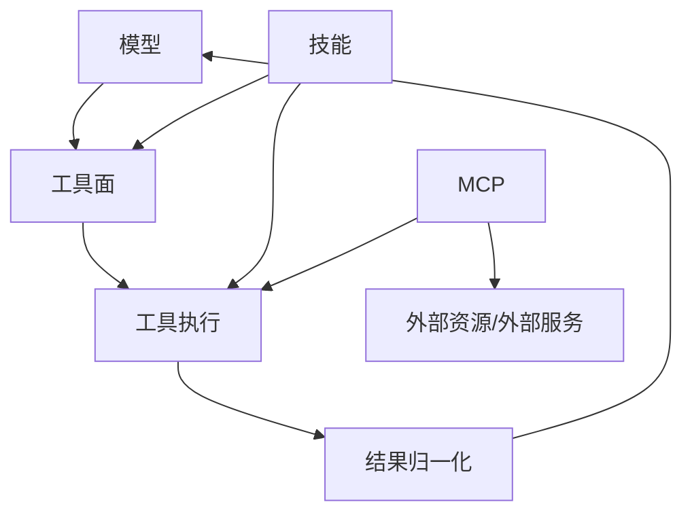
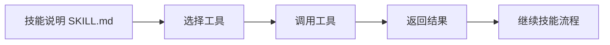
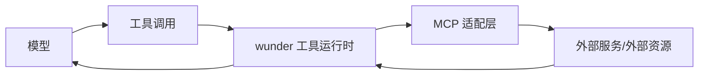

# 工具、技能与 MCP 系统设计

## 1. 目标

wunder 的能力系统由三层组成：

- 工具：模型直接调用的最小执行单元
- 技能：对工具和流程的可复用组织
- MCP：把外部资源和外部能力接入 wunder 的扩展边界

三者不是平行孤岛，而是同一能力体系的三个视角。

## 2. 总体关系

含义是：

- 模型首先看到的是工具面
- 技能负责把多个工具组织成稳定流程
- MCP 负责把 wunder 之外的能力接进来

## 3. 设计边界

| 项 | 边界 |
| --- | --- |
| 工具 | 面向模型的直接调用能力 |
| 技能 | 面向流程复用，不是新的运行时原语 |
| MCP | 面向外部接入，不绕开 wunder 的治理链 |
| 治理 | 审批、超时、隔离、重试、观测必须统一落在运行时 |

因此：

- 技能不能绕开工具治理
- MCP 不能绕开工具治理
- 高风险能力不能只靠提示词约束

## 4. 工具系统定位

工具系统是模型与真实世界的主通道。  
其设计目标不是“把后端原样暴露给模型”，而是“给模型一个可调用、可纠错、可治理的能力面”。

当前工具系统已经分成四层：

| 层 | 作用 | 主要落点 |
| --- | --- | --- |
| 模型侧工具面 | 暴露工具名、短 description、canonical schema | `src/services/tools/catalog.rs` |
| 兼容解析层 | 吃掉别名、历史字段和兼容输入 | `src/services/tools.rs`、各工具实现 |
| 执行治理层 | 调度、审批、并行、超时、失败治理 | `src/services/tools/dispatch.rs`、`src/orchestrator/` |
| 返回归一层 | 统一成功包、失败包和 compact 结果 | `build_model_tool_success*`、`build_failed_tool_result` |

更细的工具设计原则见：

- [工具设计](C:\Users\sjxx\Desktop\wunder\docs\设计文档\工具设计.md)

## 5. 技能系统定位

技能的目标不是增加另一套执行引擎，而是把稳定流程沉淀成可复用资产。

适合做成技能的场景：

- 固定的文档生产流程
- 稳定的资料加工流程
- 团队约定好的任务模板
- 一类工具组合的最佳实践

不适合做成技能的场景：

- 只是一个普通工具的别名
- 没有稳定流程结构，只有临时 prompt
- 试图绕开工具治理直接执行高风险动作

### 技能与工具的关系

结论：

- 技能组织工具
- 技能不替代工具

## 6. MCP 系统定位

MCP 的目标是把 wunder 之外的能力接进来，但仍纳入 wunder 的统一治理。

它适合：

- 接入外部知识或资源
- 接入第三方系统能力
- 跨应用、跨仓库、跨组织域协作

它不应该变成：

- 绕过 wunder 内部工具系统的捷径
- 另一套完全独立的执行平面

### MCP 的位置

## 7. 当前能力目录

| 模块 | 主要目录 |
| --- | --- |
| 工具实现 | `src/services/tools/` |
| 工具目录与注册 | `src/services/tools/catalog.rs` |
| 工具路由分发 | `src/services/tools/dispatch.rs` |
| 技能 | `src/services/skills.rs` `config/skills/` |
| MCP | `src/services/mcp.rs` `extra_mcp/` |
| 浏览器与桌面桥接 | `src/services/browser/` `src/services/tools/desktop_control.rs` |

## 8. 当前落地状态

### 8.1 工具面

当前工具面已经从“后端直出”转向“模型侧收口”：

- 大多数高频工具已切到短 description
- 大量低频兼容字段已不再直接暴露给模型
- 多动作工具保留，但统一以 `action` 为入口
- 大多数工具结果已进入统一成功/失败包

### 8.2 技能面

当前技能仍保持“产品化流程层”的定位，主要承担：

- 流程复用
- 文档化说明
- 团队能力沉淀

### 8.3 MCP 面

当前 MCP 仍是外部接入边界，不直接替代内置工具系统。  
设计上应继续坚持：

- 统一治理
- 统一观测
- 统一返回规范

## 9. 当前主要问题

| 方向 | 当前现实 |
| --- | --- |
| 工具 | 少数协议型工具与内部子结果仍保留特例 shape |
| 技能 | 技能说明质量仍依赖具体技能内容，不完全统一 |
| MCP | 外部返回体与内置工具返回体的一致性还可继续增强 |
| 文档 | 工具设计细节与总览设计需要持续保持同步 |

## 10. 演进原则

后续演进建议按下面顺序推进：

1. 先收口模型侧工具面，再扩展新工具。
2. 先把高频工具结果做 compact，再考虑新观测字段。
3. 技能优先沉淀稳定流程，不做临时能力堆砌。
4. MCP 优先做统一治理，不优先做功能数量膨胀。

## 11. 相关文档

- [工具设计](C:\Users\sjxx\Desktop\wunder\docs\设计文档\工具设计.md)
- `docs/工具结构优化表.md`
- `docs/工具返回内容优化表.md`
