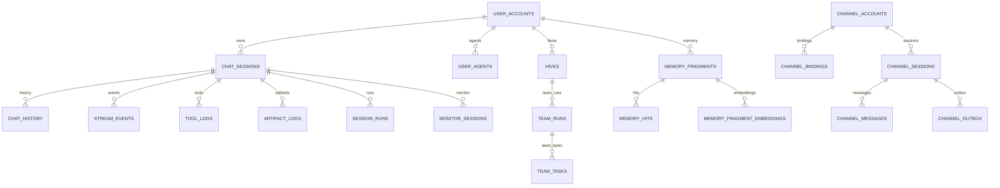

# 数据存储与状态模型设计

## 1. 设计目标

本册吸收原 `docs/数据库设计.md` 的正式内容，用于定义 wunder 当前代码对齐的数据模型、后端策略、表域划分、性能索引与保留策略。

数据存储设计既要支撑高并发访问和多形态复用，也要避免“什么都往一张表、一坨 JSON 里塞”的短期做法。

## 2. 存储基线

系统当前明确采用双后端策略：

| 场景 | 数据库 | 设计要求 |
| --- | --- | --- |
| `wunder-server` | PostgreSQL | 组织级、多用户、多连接、可治理 |
| `wunder-desktop` | SQLite | 本地单机、轻量、稳定、易分发 |
| `wunder-cli` | 本地存储抽象 | 依运行配置使用 SQLite 或本地嵌入式形态 |

二者必须共享统一的存储抽象，不能为了本地模式再维护一套完全不同的数据模型。

## 3. 后端选择与初始化策略

### 3.1 后端选择

`build_storage` 的选择规则为：

- `storage.backend` 为空时默认走 `sqlite`。
- `sqlite` / `default` 对应 `SqliteStorage`。
- `postgres` / `postgresql` / `pg` / `auto` 对应 `PostgresStorage`。

### 3.2 启动初始化

`ensure_initialized` 在启动阶段自动执行：

- `CREATE TABLE IF NOT EXISTS`。
- 缺失列补齐（`ensure_*_columns`）。
- 缺失索引补齐。
- PostgreSQL 额外性能索引补齐。

这保证原型阶段可平滑升级，不依赖重型迁移框架。

## 4. 数据类别与状态边界

建议将数据按“真相层级”分为四类：

| 类别 | 示例 | 设计要求 |
| --- | --- | --- |
| Durable Business State | 用户、组织、agent、hive、team run、channel 绑定 | 作为业务真相源 |
| Durable Runtime State | 线程快照、checkpoint、waiting 状态、工具日志 | 支撑恢复与审计 |
| Derived Projection State | 投影快照、摘要缓存、列表加速数据 | 可重建，不可替代真相源 |
| Ephemeral State | 进程内 watch、连接态、临时目录、热缓存 | 可丢失、可重建 |

这个区分很重要，因为很多实时问题本质上是把“派生状态”误当成了“真相源”。

## 5. 字段与约束约定

- 时间字段统一为秒级浮点时间戳（`DOUBLE PRECISION` / `REAL`，来源 `now_ts`）。
- JSON、列表、多值字段统一序列化为文本列存储。
- 布尔语义跨库统一：SQLite 用 `INTEGER(0/1)`，PostgreSQL 以 `INTEGER` 或 `BOOLEAN` 实现。
- 业务主键大多为文本 ID；日志明细常用自增主键。
- 关系约束以应用层为主；数据库层目前仅保留 `team_tasks.team_run_id -> team_runs(team_run_id)` 级联删除外键。

## 6. 全量表清单

当前代码对齐的全量表为 51 张：

### 6.1 元数据与会话运行（11）

- `meta`
- `chat_sessions`
- `chat_history`
- `tool_logs`
- `artifact_logs`
- `stream_events`
- `monitor_sessions`
- `session_locks`
- `session_runs`
- `agent_threads`
- `agent_tasks`

### 6.2 记忆域（7）

- `memory_settings`
- `memory_records`
- `memory_task_logs`
- `memory_fragments`
- `memory_fragment_embeddings`
- `memory_hits`
- `memory_jobs`

### 6.3 用户世界与蜂房群聊（6）

- `user_world_conversations`
- `user_world_groups`
- `user_world_members`
- `user_world_messages`
- `user_world_events`
- `beeroom_chat_messages`

### 6.4 定时任务域（2）

- `cron_jobs`
- `cron_runs`

### 6.5 渠道与媒体域（8）

- `channel_accounts`
- `channel_bindings`
- `channel_user_bindings`
- `channel_sessions`
- `channel_messages`
- `channel_outbox`
- `media_assets`
- `speech_jobs`

### 6.6 网关控制平面域（3）

- `gateway_clients`
- `gateway_nodes`
- `gateway_node_tokens`

### 6.7 用户治理与智能体域（8）

- `user_accounts`
- `org_units`
- `user_tokens`
- `user_tool_access`
- `user_agents`
- `user_agent_access`
- `external_links`
- `hives`

### 6.8 蜂群执行域（2）

- `team_runs`
- `team_tasks`

### 6.9 评估与知识域（4）

- `benchmark_runs`
- `benchmark_attempts`
- `benchmark_task_aggregates`
- `vector_documents`

## 7. 关键关系与一致性

### 7.1 关系总览

### 7.2 一致性边界

- 会话主线由 `chat_sessions` 驱动，日志与事件表通过 `user_id + session_id` 聚合。
- 线程排队模型由 `agent_threads + agent_tasks` 承载。
- 蜂群运行模型由 `hives + team_runs + team_tasks` 承载。
- 用户世界消息域（`user_world_*`）与 `chat_*` 域隔离。
- 绝大部分级联清理由服务层显式执行；`team_tasks` 的级联删除由数据库外键补强。

## 8. 关键表与边界处理

### 8.1 边界处理与稳定性保障相关表

| 表名 | 边界处理职责 | 关键字段 |
| --- | --- | --- |
| `stream_events` | 事件回放与断线恢复 | `event_id`、`after_event_id`、`event_type` |
| `agent_threads` | 线程状态管理与恢复 | `status`、`last_state_update_at` |
| `agent_tasks` | 排队任务管理 | `status`、`priority`、`retry_count` |
| `session_locks` | 会话互斥与超时 | `lock_holder`、`lock_expires_at`、`heartbeat_at` |
| `chat_sessions` | 会话状态持久化 | `context_tokens_peak`、`last_compaction_at` |
| `monitor_sessions` | 监控与可观测性 | `status`、`context_tokens`、`context_tokens_peak` |

这些表共同实现：

- 事件持久化与断线续传。
- 会话锁与超时管理。
- 线程状态与恢复。
- 队列任务与重试。
- 上下文压缩历史记录。

### 8.2 `user_agents`

当前智能体配置字段已包含：

- `hive_id`
- `declared_tool_names`
- `declared_skill_names`
- `approval_mode`
- `preset_questions`
- `preset_binding`
- `sandbox_container_id`

索引包括：

- `idx_user_agents_user`
- `idx_user_agents_user_hive`

### 8.3 `memory_fragments` 相关四表

`memory_fragments` 提供结构化长期记忆主表：

- 三层内容：`title_l0` / `summary_l1` / `content_l2`
- 语义字段：`fact_key` / `tags` / `entities`
- 生命周期字段：`tier` / `status` / `pinned` / `confirmed_by_user`
- 统计字段：`access_count` / `hit_count` / `last_accessed_at`

配套表：

- `memory_fragment_embeddings`：每个记忆片段的 embedding 缓存。
- `memory_hits`：命中解释与评分轨迹。
- `memory_jobs`：记忆任务执行记录。

### 8.4 `user_world_*` 与 `beeroom_chat_messages`

- `user_world_conversations`：会话主表（`direct/group`）。
- `user_world_groups`：群元数据。
- `user_world_members`：成员读状态、未读缓存、置顶静音。
- `user_world_messages`：消息明细（`client_msg_id` 幂等）。
- `user_world_events`：事件流（WS/SSE 续传）。
- `beeroom_chat_messages`：蜂房协作聊天持久化。

### 8.5 `team_runs` / `team_tasks`

`team_runs` 聚合蜂群执行统计：

- `task_total/task_success/task_failed`
- `context_tokens_total/context_tokens_peak`
- `model_round_total`

`team_tasks` 记录任务粒度执行状态：

- `target_session_id / spawned_session_id / session_run_id`
- `retry_count / priority / result_summary / error`

### 8.6 `vector_documents`

向量文档元数据与切片文本统一存储在关系库：

- `owner_id / base_name / doc_name`
- `embedding_model / chunk_size / chunk_overlap / chunk_count`
- `content / chunks_json`

索引：

- `idx_vector_documents_owner_base`

## 9. 性能、保留与稳定性

### 9.1 索引策略

基础索引由建表 SQL 保证；PostgreSQL 额外补齐以下性能索引：

- `idx_tool_logs_tool_time`
- `idx_tool_logs_time`
- `idx_chat_history_time`
- `idx_artifact_logs_time`
- `idx_monitor_sessions_updated`
- `idx_monitor_sessions_user`

同时清理遗留索引 `idx_user_accounts_username`，避免冗余。

### 9.2 保留策略

`retention_days > 0` 时清理以下热日志表：

- `chat_history`
- `tool_logs`
- `artifact_logs`
- `monitor_sessions`
- `stream_events`
- `session_runs`

并排除角色含 `admin` / `super_admin` 的用户数据。

### 9.3 性能与稳定性要求

| 方向 | 要求 |
| --- | --- |
| 查询路径 | 高频查询要避免全表扫描和多次重复 hydrate |
| 写入路径 | 热路径写入应尽量扁平、可批处理、避免重复持久化 |
| 恢复路径 | checkpoint 和 thread snapshot 恢复应是常规路径，不是异常路径 |
| 桌面端 | SQLite 设计需兼顾本地文件锁、体积和损坏恢复 |
| 服务端 | PostgreSQL 设计需兼顾多用户并发和运维可观测性 |

## 10. 变更落地约束

后续如新增或修改存储模型，至少同步更新三处：

1. `src/storage/sqlite.rs` 与 `src/storage/postgres.rs` 的建表或补列逻辑。
2. 本文档的表清单、关键字段、索引或保留策略章节。
3. `docs/配置与状态存储梳理.md` 中数据库“配置 / 状态边界”章节。

## 11. 验收标准

- server 与 desktop 共享统一数据抽象，差异被限制在后端实现层。
- 线程恢复依赖 durable state，而不是只能靠在线进程。
- 投影缓存与业务真相源有清晰区分。
- 新增数据对象时能明确归类到 durable、derived 或 ephemeral。

## 12. 相关文档

- `docs/设计文档/01-系统总体设计.md`
- `docs/设计文档/06-记忆、知识与工作区系统设计.md`
- `docs/API/08-admin-knowledge-users-and-memory.md`
- `docs/API/09-monitoring-performance-and-benchmarks.md`
