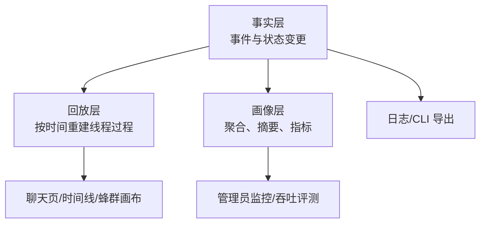
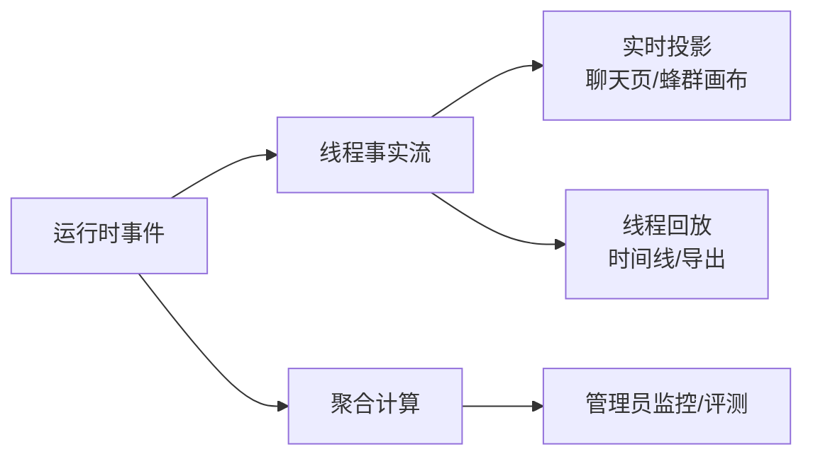
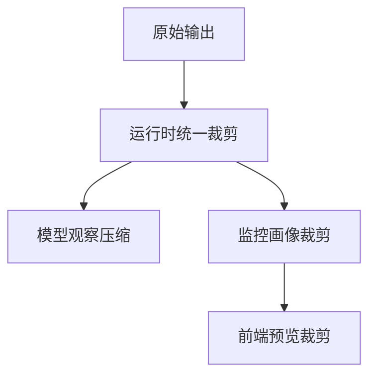

# 可观测性设计

## 1. 设计目标

wunder 的可观测性不是“多打日志”，而是让系统在运行中持续回答三件事：

1. 现在发生了什么。
2. 为什么会这样。
3. 出问题后能否复原事实。

因此它不是单一监控面板，而是一套分层真相体系。

## 2. 设计原则与硬约束

### 2.1 原则

- 事实优先：先保证“发生过什么”可追溯，再做聚合与展示。
- 分层暴露：同一份运行信息，不让一个视图同时承担实时、治理、排障三种职责。
- 过程可见：不仅看最终答案，还要看中间状态、失败、重试与恢复。
- 展示从属于事实：前端可以重组表达，但不能反向定义后端真相。

### 2.2 硬约束

- 聚合视图不是原始事实。
- 前端展示不是权威数据源。
- 请求、结果、观察结果三者必须分离。
- 单线程回放与系统级画像必须分离。
- 裁剪可以存在，但必须知道裁剪发生在哪一层。
- 同一指标在不同页面必须口径一致。

## 3. 总体模型

三层分工如下：

- 事实层：保存真实事件，解决“到底发生过什么”。
- 回放层：按顺序重建单线程或单任务过程，解决“它是怎么走到这里的”。
- 画像层：做系统级聚合，解决“整体运行得怎样”。

这三层不能互相越权。事实层负责真相，画像层负责治理，展示层负责理解。

## 4. 观测面分工

| 观测面 | 主要回答的问题 | 设计边界 |
| --- | --- | --- |
| 聊天页 | 当前这一轮正在怎么运行 | 不承担全局统计 |
| 时间线详情 | 单线程完整过程如何展开 | 不替代运维总览 |
| 蜂群画布 | 母蜂与工蜂如何协作、谁卡住了 | 不做全文回放 |
| 管理员监控 | 当前系统负载、活跃线程、整体状态如何 | 不保留最细流式细节 |
| 吞吐与评测 | 延迟、吞吐、质量是否退化 | 不替代线上线程排障 |
| 日志与 CLI | 离线排障、导出、脚本消费 | 不承担富交互展示 |

设计重点不是“每个页面都展示全部信息”，而是“每个页面只展示自己最该负责的那部分真相”。

## 5. 工作流如何被看见

一个完整的工作流至少要让以下节点可见：

- 模型请求开始
- 增量输出
- 工具调用与工具结果
- 上下文压缩
- 审批、等待、重试
- 轮次终态

这里的关键不是“字段尽量多”，而是“状态迁移连续、终态明确、失败可追溯”。

## 6. 请求、结果、流程的可观测定义

### 6.1 请求

请求可见，指的是模型调用本身可见，而不是只有外围 HTTP 访问记录。  
系统必须能判断：

- 请求是否已经发出
- 该请求属于普通回复、压缩还是评测
- 请求是否进入等待、失败或重试

默认视图可以展示摘要；调试视图必须能回到更完整的请求结构。

### 6.2 结果

结果必须至少分成三类：

- 模型最终输出
- 工具返回结果
- 真正注入后续推理的观察结果

如果这三类信息混在一起，系统就无法判断问题究竟来自工具、裁剪还是展示层简化。

### 6.3 流程

流程可见，意味着中间态持续可更新，而不是最后一次性回填最终答案。  
因此可观测性的核心载体应当是“事件序列”，而不是单条摘要文本。

## 7. 裁剪与指标约束

### 7.1 裁剪约束

- 运行时裁剪解决成本与规模问题。
- 模型观察压缩解决后续推理上下文问题。
- 监控裁剪解决聚合和展示成本问题。
- 前端预览裁剪只解决可读性问题。

排障时必须优先回到事实层，而不是停留在已经被裁剪过的展示结果上。

### 7.2 指标约束

最容易失真的指标只有两类：速度与上下文。

速度必须区分：

- 首字延迟
- 预填充速度
- 解码速度

三者回答的是不同问题，不能混成一个“平均速度”。

上下文占用必须以权威快照为准，再辅以中间估算。否则就会出现：

- 中间值比最终值更大
- 百分比失真
- 压缩前后对比位置错误

## 8. 蜂群场景的特殊要求

蜂群不是单线程聊天的放大版，而是多执行体协作系统，因此必须额外满足：

- 母蜂调度过程可见
- 工蜂执行进度可见
- 汇总结果与节点终态可见
- 单个工蜂必要时可追到子会话

蜂群观测最忌讳两件事：

- 只看到最终汇总，看不到中间分工
- 只看到节点列表，看不到节点当前在做什么

## 9. 推荐排障路径

| 问题类型 | 第一观察面 | 第二观察面 | 第三观察面 |
| --- | --- | --- | --- |
| 单线程异常 | 聊天工作流 | 时间线详情 | 调试导出 |
| 工具异常 | 工具工作流 | 时间线详情 | 日志 |
| 压缩异常 | 压缩工作流 | 时间线详情 | 调试画像 |
| 蜂群异常 | 蜂群画布 | 父会话流程 | 子会话或日志 |
| 系统压力 | 管理员监控 | 吞吐评测 | 服务日志 |

## 10. 结论

wunder 的可观测性本质上是一套分层约束：

- 事实层保证可追溯
- 回放层保证可复盘
- 画像层保证可治理
- 展示层保证可理解

只要不混淆事实、摘要、请求、结果和观察结果，系统就能同时满足三件事：

- 用户看得懂过程
- 管理员看得见全局
- 开发者排得清问题
