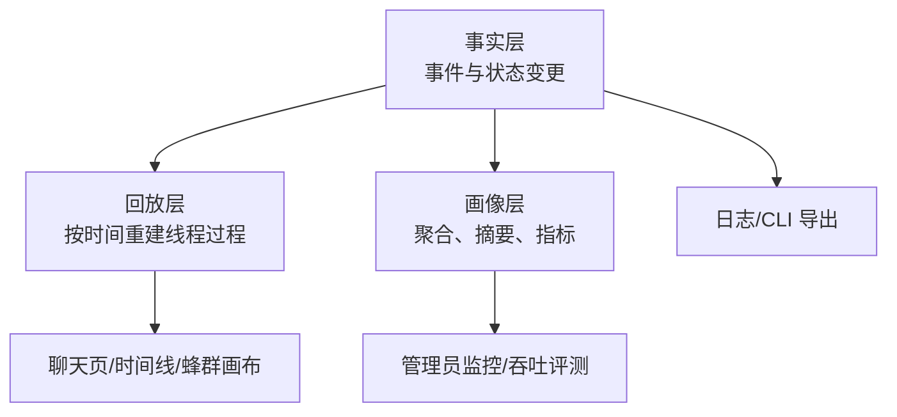
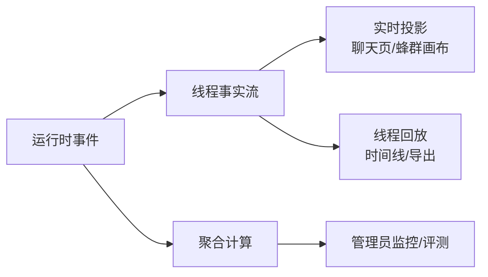
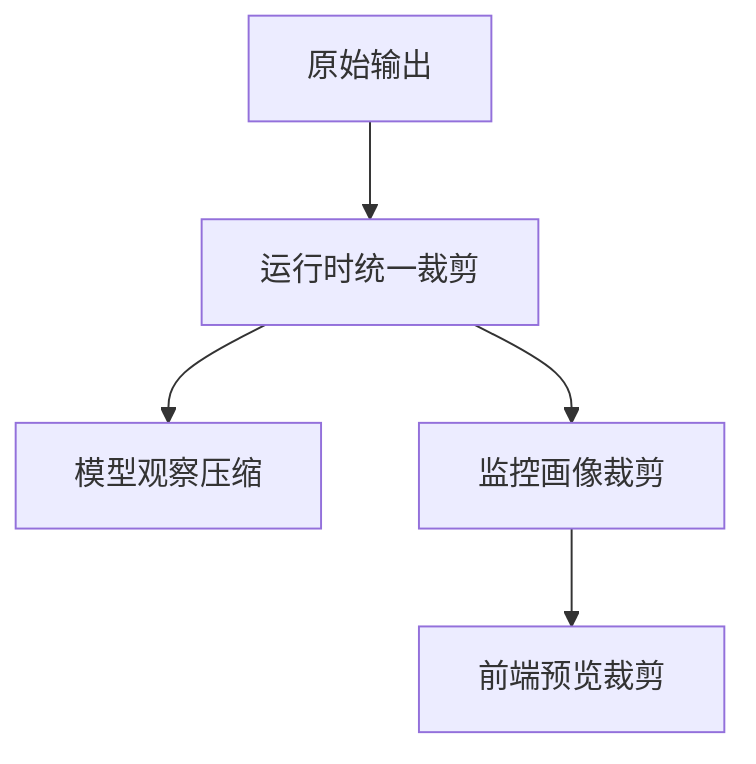

# 可观测性设计

## 1. 设计目标

wunder 的可观测性不是“多打日志”，而是让系统在运行中持续回答三件事：

1. 现在发生了什么。
2. 为什么会这样。
3. 出问题后能否复原事实。

因此它不是单一监控面板，而是一套分层真相体系。

## 2. 设计原则与硬约束

### 2.1 原则

- 事实优先：先保证“发生过什么”可追溯，再做聚合与展示。
- 分层暴露：同一份运行信息，不让一个视图同时承担实时、治理、排障三种职责。
- 过程可见：不仅看最终答案，还要看中间状态、失败、重试与恢复。
- 展示从属于事实：前端可以重组表达，但不能反向定义后端真相。

### 2.2 硬约束

- 聚合视图不是原始事实。
- 前端展示不是权威数据源。
- 请求、结果、观察结果三者必须分离。
- 单线程回放与系统级画像必须分离。
- 裁剪可以存在，但必须知道裁剪发生在哪一层。
- 同一指标在不同页面必须口径一致。

## 3. 总体模型

```mermaid
flowchart TD
    A[事实层\n事件与状态变更] --> B[回放层\n按时间重建线程过程]
    A --> C[画像层\n聚合、摘要、指标]
    B --> D[聊天页/时间线/蜂群画布]
    C --> E[管理员监控/吞吐评测]
    A --> F[日志/CLI 导出]
```

三层分工如下：

- 事实层：保存真实事件，解决“到底发生过什么”。
- 回放层：按顺序重建单线程或单任务过程，解决“它是怎么走到这里的”。
- 画像层：做系统级聚合，解决“整体运行得怎样”。

这三层不能互相越权。事实层负责真相，画像层负责治理，展示层负责理解。

## 4. 观测面分工

| 观测面 | 主要回答的问题 | 设计边界 |
| --- | --- | --- |
| 聊天页 | 当前这一轮正在怎么运行 | 不承担全局统计 |
| 时间线详情 | 单线程完整过程如何展开 | 不替代运维总览 |
| 蜂群画布 | 母蜂与工蜂如何协作、谁卡住了 | 不做全文回放 |
| 管理员监控 | 当前系统负载、活跃线程、整体状态如何 | 不保留最细流式细节 |
| 吞吐与评测 | 延迟、吞吐、质量是否退化 | 不替代线上线程排障 |
| 日志与 CLI | 离线排障、导出、脚本消费 | 不承担富交互展示 |

设计重点不是“每个页面都展示全部信息”，而是“每个页面只展示自己最该负责的那部分真相”。

## 5. 工作流如何被看见

```mermaid
flowchart LR
    A[运行时事件] --> B[线程事实流]
    B --> C[实时投影\n聊天页/蜂群画布]
    B --> D[线程回放\n时间线/导出]
    A --> E[聚合计算]
    E --> F[管理员监控/评测]
```

一个完整的工作流至少要让以下节点可见：

- 模型请求开始
- 增量输出
- 工具调用与工具结果
- 上下文压缩
- 审批、等待、重试
- 轮次终态

这里的关键不是“字段尽量多”，而是“状态迁移连续、终态明确、失败可追溯”。

## 6. 请求、结果、流程的可观测定义

### 6.1 请求

请求可见，指的是模型调用本身可见，而不是只有外围 HTTP 访问记录。  
系统必须能判断：

- 请求是否已经发出
- 该请求属于普通回复、压缩还是评测
- 请求是否进入等待、失败或重试

默认视图可以展示摘要；调试视图必须能回到更完整的请求结构。

### 6.2 结果

结果必须至少分成三类：

- 模型最终输出
- 工具返回结果
- 真正注入后续推理的观察结果

如果这三类信息混在一起，系统就无法判断问题究竟来自工具、裁剪还是展示层简化。

### 6.3 流程

流程可见，意味着中间态持续可更新，而不是最后一次性回填最终答案。  
因此可观测性的核心载体应当是“事件序列”，而不是单条摘要文本。

## 7. 裁剪与指标约束

```mermaid
flowchart TD
    A[原始输出] --> B[运行时统一裁剪]
    B --> C[模型观察压缩]
    B --> D[监控画像裁剪]
    D --> E[前端预览裁剪]
```

### 7.1 裁剪约束

- 运行时裁剪解决成本与规模问题。
- 模型观察压缩解决后续推理上下文问题。
- 监控裁剪解决聚合和展示成本问题。
- 前端预览裁剪只解决可读性问题。

排障时必须优先回到事实层，而不是停留在已经被裁剪过的展示结果上。

### 7.2 指标约束

最容易失真的指标只有两类：速度与上下文。

速度必须区分：

- 首字延迟
- 预填充速度
- 解码速度

三者回答的是不同问题，不能混成一个“平均速度”。

上下文占用必须以权威快照为准，再辅以中间估算。否则就会出现：

- 中间值比最终值更大
- 百分比失真
- 压缩前后对比位置错误

## 8. 蜂群场景的特殊要求

蜂群不是单线程聊天的放大版，而是多执行体协作系统，因此必须额外满足：

- 母蜂调度过程可见
- 工蜂执行进度可见
- 汇总结果与节点终态可见
- 单个工蜂必要时可追到子会话

蜂群观测最忌讳两件事：

- 只看到最终汇总，看不到中间分工
- 只看到节点列表，看不到节点当前在做什么

## 9. 推荐排障路径

| 问题类型 | 第一观察面 | 第二观察面 | 第三观察面 |
| --- | --- | --- | --- |
| 单线程异常 | 聊天工作流 | 时间线详情 | 调试导出 |
| 工具异常 | 工具工作流 | 时间线详情 | 日志 |
| 压缩异常 | 压缩工作流 | 时间线详情 | 调试画像 |
| 蜂群异常 | 蜂群画布 | 父会话流程 | 子会话或日志 |
| 系统压力 | 管理员监控 | 吞吐评测 | 服务日志 |

## 10. 结论

wunder 的可观测性本质上是一套分层约束：

- 事实层保证可追溯
- 回放层保证可复盘
- 画像层保证可治理
- 展示层保证可理解

只要不混淆事实、摘要、请求、结果和观察结果，系统就能同时满足三件事：

- 用户看得懂过程
- 管理员看得见全局
- 开发者排得清问题

## 工作线程额度摘要

工作线程列表的额度展示读取独立的 `quota_used` 累计摘要：运行时完成每次额度准入后更新 monitor，与账户扣减口径一致，包括重试及压缩摘要请求。摘要随现有 JSON 记录持久化，并由 `quota_usage.session_quota_used` 发布绝对累计值；前端同步目录缓存，重复或乱序值仅取最大值。Token 消耗、工具次数和账户总用量均不可代替线程额度，缺少可靠历史基线时保持未知。额度摘要是展示投影，账户存储仍是扣减权威来源。

## 管理端单场景模型吞吐测试

吞吐测试位于 ops 控制面，通过共享 LLM 的协议、鉴权与 usage 归一适配直接发送一次流式模型请求。测试与真实线程执行隔离，不进入 orchestrator，不创建用户、线程、工具调用、长期记忆或监控日志，因此不影响线程提示词冻结。

`ops/throughput.rs` 持有唯一活动任务、取消信号与最多 50 条历史；`services/llm/benchmark.rs` 负责有界流读取、定长参数与计时；`api/admin/throughput_admin.rs` 负责管理员接口与短期单次票据；`web/modules/throughput/` 按控制、视图、曲线与文案拆分。历史摘要仍用独立 JSON 文件，SQLite/PostgreSQL 都不写测试会话表；临时文件替换且保存期间不接受下一轮，避免旧写覆盖新结果。

实时投影采用 500 ms 完整快照与连接内序号，重连重新鉴权补水；网络发送有超时，事件大小与总流量有界。流内容只计数字节、usage 和时间，不留存文本。输入长度为估算，实际用量单列；输出目标不是实测值，定长参数也不能代替完成后的达标核验。失败、取消、缺失 usage 与长度不符必须明确展示，默认曲线仅选达标记录。同模型与输出长度成组，以输入长度或测试时间为横轴，避免混合并发压测的旧口径。

虚拟模型通过 `LlmModelConfig.simulation_speed` 共享快 / 中 / 慢档位，缺省快。速率类型位于 `wunder-core/virtual_model.rs`，预处理为 2000 / 500 / 100 Token/s，思考与正文为 200 / 50 / 10 Token/s；运行时 timing 与 streaming 模块负责异步等待和有界分批输出，按绝对时间调度防止逐 Token 漂移。普通虚拟回放按本次请求的估算输入等待，不能使用历史日志中的用量替代当前输入。随机回复生成明确标识的模拟思考，日志回放保留原有内容，非流式调用也等待生成时长。

吞吐模拟在独立适配模块先发送 reasoning 增量，再发送正文，思考占总输出预算的 1/4，并通过共享 usage 解析器作为子项计入总数，避免重复计数。实际时钟记录首字与生成速度，预处理和生成期间均可取消、可超时，不创建回放线程。历史快照冻结当次速度档位，曲线按档位分组，旧摘要标为 legacy。Docker 验收另用 HTTP 模型夹具覆盖真实网络、SSE、定长参数、思考统计、缺失用量和断流路径。

## 模拟模型能力与请求校验

`services/virtual_llm/capabilities.rs` 是模拟服务端能力边界，普通回放与吞吐共用请求校验和输入计量；能力使用现有模型字段，额外选项类型放在 core 的 `virtual_model.rs`。上下文包含输入、工具定义和预留输出，正好等于窗口允许，越界返回供应商风格错误并接回运行时压缩恢复。能力错误不可重试，不能当连接失败反复退避。输出预算覆盖思考、正文、工具调用；回放的旧 usage 不再用于本次统计。

`virtual_llm/request.rs` 准备有界响应，不持有线程状态、不执行工具。调用名称、参数及顺序只来自回放日志，不接受手填调用场景。`orchestrator/virtual_replay_protocol.rs` 复用执行链的调用解析器归一文本和结构化日志并去重，`virtual_llm/tool_protocol.rs` 按线程冻结的 `tool_call_mode` 映射原生 function_call、文本 tool_call 或 freeform_call 原生/回退通道。保留调用 ID，缺失时按日志轮次生成稳定 ID；日志轮次耗尽不循环。参数中的协议分隔符转义，文本调用超出输出预算时整块移除，避免部分参数被执行。媒体不会下载或识别，只检查能力并按每项配置计量。吞吐不执行回放工具，但共享文本长度、思考能力与思考预算。
