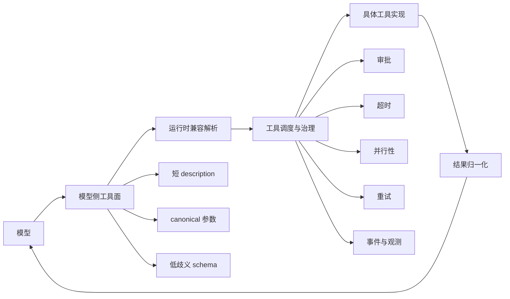
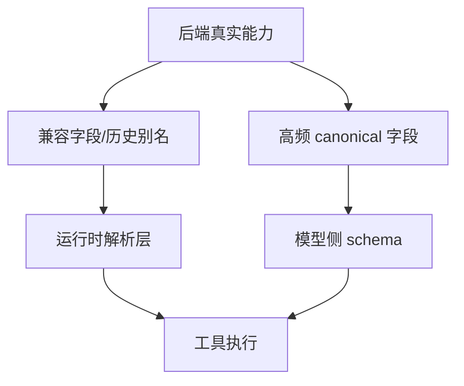
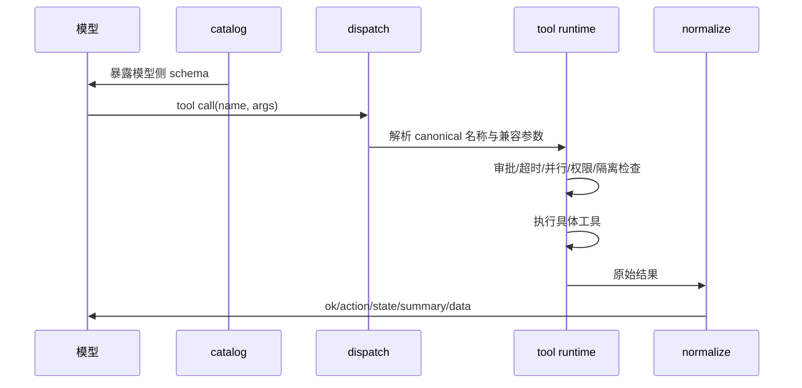

# 工具设计

## 1. 目标

wunder 的工具系统承担三件事：

- 把后端能力稳定地暴露给模型。
- 把高风险能力纳入统一治理，而不是只靠提示词约束。
- 让模型看到的是“简洁工具面”，让运行时保留“完整兼容面”。

当前设计已经不再把“工具定义”和“工具执行”视为一件事，而是明确拆成：

- 模型侧工具面
- 运行时兼容解析层
- 工具执行层
- 结果归一化层

## 2. 核心原则

| 原则 | 含义 |
| --- | --- |
| 一切皆工具 | 对模型来说，文件、浏览器、记忆、蜂群、渠道、线程都应表现为统一工具语义 |
| 简洁暴露 | 模型只看到 canonical 名称、关键参数和短规则 |
| 兼容下沉 | 历史别名、兼容字段、后台细节留在运行时解析层，不直接暴露给模型 |
| 成套不拆散 | 多动作工具可以保留，只要 `action` 清晰、参数边界清晰 |
| 结果可推理 | 工具返回要直接服务下一步推理，而不是完整回放后端世界 |
| 高风险必治理 | 命令、桌面、外部渠道、浏览器等能力必须受审批、超时、隔离、重试治理 |

## 3. 总体结构



## 4. 分层模型

| 层 | 作用 | 当前落点 |
| --- | --- | --- |
| 模型侧工具面 | 给模型看的工具名、description、schema | `src/services/tools/catalog.rs` |
| 兼容解析层 | 吃掉别名、兼容字段、历史调用形态 | `src/services/tools.rs`、各工具文件内部反序列化 |
| 调度治理层 | 路由、审批、并行、超时、失败治理 | `src/services/tools/dispatch.rs`、`src/orchestrator/` |
| 工具实现层 | 真正执行文件、浏览器、线程、渠道等能力 | `src/services/tools/` |
| 返回归一层 | 统一成功包、失败包、摘要和精简数据 | `build_model_tool_success*`、`build_failed_tool_result` |

## 5. 模型侧工具面设计

### 5.1 目标

模型侧 schema 的目标不是“完整表达后端接口”，而是“让模型更容易调用正确”。

因此模型看到的工具定义应满足：

- `name` 稳定
- `description` 短
- `parameters` 只保留高频 canonical 字段
- `additionalProperties` 尽量关闭
- 少用 `allOf/if/then/anyOf`

### 5.2 推荐形态

| 项 | 推荐 |
| --- | --- |
| 工具名 | 一个 canonical 名称，不混多套别名 |
| 动作入口 | 多动作工具统一使用 `action` |
| 参数命名 | 只暴露 snake_case canonical 字段 |
| 描述写法 | 1 句用途 + 1 句常用流程 + 1 句边界提醒 |
| 字段数量 | 优先保留高频字段，低频字段下沉到兼容层 |

### 5.3 设计示意



结论是：

- 模型侧 schema 要窄
- 运行时解析层要宽

## 6. 返回内容设计

### 6.1 统一骨架

当前工具返回设计已经统一向如下结构靠拢：

```json
{
  "ok": true,
  "action": "search_content",
  "state": "completed",
  "summary": "Found 3 matches in 2 files.",
  "data": {}
}
```

失败则统一为：

```json
{
  "ok": false,
  "error": "Missing required field: session_id",
  "data": {
    "action": "history"
  },
  "meta": {
    "code": "missing_field",
    "retryable": true
  }
}
```

### 6.2 设计要求

| 项 | 要求 |
| --- | --- |
| 成功信号 | 统一 `ok`，必要时补 `state` |
| 摘要 | `summary` 只写结果，不写实现细节 |
| 主结果 | 统一进入 `data` |
| 下一步提示 | 异步或链式工具才补 `next_step_hint` |
| 错误表达 | 结构化、可纠错、可重试 |
| 大对象返回 | 默认做 compact，不直接回传全量世界 |

## 7. 工具族设计

| 工具族 | 代表工具 | 设计重点 |
| --- | --- | --- |
| 回复控制 | `final_response` `a2ui` `计划面板` `问询面板` `会话让出` | 强调交互语义，不承载后台噪声 |
| 文件与代码 | `list_files` `search_content` `read_file` `write_file` `apply_patch` `execute_command` `ptc` `LSP查询` | 精确、可组合、可继续读写 |
| 状态与记忆 | `记忆管理` `self_status` | 返回要短，避免把监控与存储细节灌给模型 |
| 线程与协作 | `thread_control` `subagent_control` `智能体蜂群` | 多动作不拆，但必须 canonical 收口 |
| 外部连接 | `channel_tool` `用户世界工具` `web_fetch` `browser` `a2a观察` `a2a等待` | 把交互复杂度压在运行时，不压给模型 |
| 桌面能力 | `desktop_controller` `desktop_monitor` | 强治理、强约束、低噪声 |

## 8. 执行主链



## 9. 当前收口方向

### 9.1 已落实的方向

| 方向 | 状态 | 说明 |
| --- | --- | --- |
| 模型侧 schema 收口 | 已大面积落地 | 大多数高频工具已切到短 description + canonical 参数 |
| 低频字段隐藏 | 已大面积落地 | 大量兼容字段、后台字段、历史别名已不再直接暴露给模型 |
| 返回统一骨架 | 已进入主链路 | 绝大多数工具返回已改为统一成功/失败 helper |
| 测试约束 | 已建立 | `catalog.rs` 已补多项 schema 约束测试 |

### 9.2 仍保留的现实

| 项 | 说明 |
| --- | --- |
| 协议型特例仍存在 | 如 `final_response`、`a2ui` 仍带有协议层语义，和普通工具不完全一样 |
| 内部子结果未全量统一 | 个别工具内部辅助结果仍保留旧 shape |
| 轻工具描述仍可继续统一 | 部分轻工具虽然已收口，但还可以进一步统一措辞风格 |

## 10. 输入与输出的设计约束

| 维度 | 约束 |
| --- | --- |
| 输入 | 不把兼容别名暴露给模型 |
| 输入 | 不把后台管理对象完整暴露给模型 |
| 输入 | 能靠短规则说明清楚，就不依赖复杂条件 schema |
| 输出 | 不回显整份请求体 |
| 输出 | 不返回后台实现细节和低价值监控噪声 |
| 输出 | 观察类工具返回“当前结论”，而不是“过程流水账” |
| 输出 | 列表类与大文本类默认要支持截断和继续读取 |

## 11. 设计判断标准

一个工具设计是否合格，可以用下面的检查表判断：

| 检查项 | 合格标准 |
| --- | --- |
| 模型是否容易选对工具 | description 能说明用途、常用流程、边界 |
| 模型是否容易填对参数 | schema 只保留高频 canonical 字段 |
| 工具是否容易治理 | 能挂接审批、超时、隔离、重试 |
| 结果是否利于下一步推理 | 返回短摘要 + 结构化主结果 |
| 是否避免上下文污染 | 不默认回传大对象、内部状态和无关细节 |

## 12. 后续演进建议

当前已经不适合继续做“无原则加字段”。后续工具设计建议遵循：

1. 先定义模型侧最小工具面，再实现运行时兼容层。
2. 新工具优先进入独立文件，不继续堆进大总表。
3. 返回结构优先进入统一 helper，不允许各自随意长出新 shape。
4. 管理端展示、用户端调试、模型侧 schema 三者要分层，而不是混用一份对象。

## 13. 相关文档

- `docs/工具结构优化表.md`
- `docs/工具返回内容优化表.md`
- `docs/设计文档/05-工具、技能与 MCP 系统设计.md`
