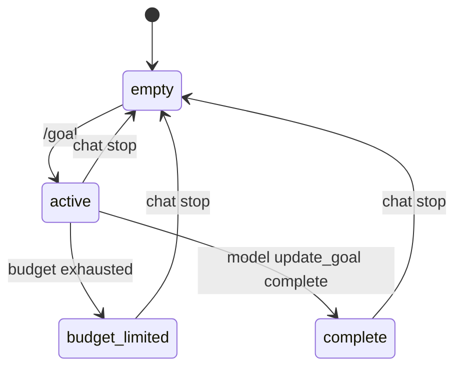

# 目标态系统设计

## 1. 文档定位

本文定义 wunder 的“目标态系统”。

目标态不是一个普通的聊天标签，也不是某个前端页面上的临时开关，而是绑定到会话线程的持久运行状态。用户通过 `/goal` 进入目标态后，智能体会围绕同一个目标持续推进，直到目标完成、用户通过聊天页终止按钮退出，或被预算限制打断。

这套设计参考 Codex 的 thread goal 语义，但不照搬它的接口形状；wunder 的目标态必须和现有的 `chat/ws`、`stream_events`、`ThreadRuntime`、PostgreSQL / SQLite 双存储，以及 CLI / Desktop / Web 的会话模型对齐。

## 2. 参考结论

从 Codex 的实现可以抽出四个核心结论：

1. 目标态是线程级持久状态，不是一次 turn 的临时上下文。
2. 一条线程只允许一个当前目标。
3. 目标状态由外部用户或系统控制，模型只能把目标标记为完成，不能自行把目标改成暂停或恢复。
4. 目标态的持续推进依赖隐藏的续跑提示，而不是改写冻结的 system prompt。

对应到 wunder，目标态必须满足以下原则：

- 目标状态和 session 绑定，不和 agent 配置绑定。
- 目标和运行态分离，`thread_status` 负责“线程现在跑不跑”，`goal_status` 负责“这条线程正在追什么目标”。
- 目标继续推进时，系统只能注入隐藏的 developer/observation 级续跑提示，不能回写线程 system prompt。
- 目标完成后停止自动续跑，除非用户重新激活或替换目标。

## 3. 系统定位

### 3.1 作用域

目标态的最小作用域是 `session_id`，也就是当前聊天线程。

建议对外继续沿用 `ThreadGoal` / `ThreadGoalStatus` 的命名，这样和现有 `thread_status`、`thread_id` 以及 Codex 的语义最接近；但持久化层可以落在 `session_goals` 这类会话级表上。

约束如下：

- 一个 `session_id` 同时只能有一个当前目标。
- 不同会话之间的目标互不影响。
- 线程切换、页面切换、连接重连都不应隐式清空目标。
- 网页端只限制目标态智能体聊天页内的新建、切换、发送和归档目标线程等操作；其他智能体、联系人、群聊、设置与资料页不应被目标态全局锁住。
- 只有聊天页终止、显式替换、会话归档/重置，才会改变网页端当前会话目标的生命周期。

### 3.2 状态机

状态含义：

- `active`：目标有效，且当线程空闲时允许自动续跑。
- `paused`：目标保留，但不再自动续跑；当前主要作为 CLI / TUI 高级控制状态。
- `budget_limited`：目标被预算限制暂停，不能继续自动推进。
- `complete`：目标已完成，不再自动推进。

## 4. 数据模型

### 4.1 目标记录

建议新增 `SessionGoalRecord`，核心字段如下：

- `goal_id`
- `session_id`
- `user_id`
- `objective`
- `status`
- `token_budget`
- `tokens_used`
- `time_used_seconds`
- `created_at`
- `updated_at`
- `completed_at`
- `last_continued_at`
- `source`

字段语义：

- `goal_id`：目标本身的稳定标识，用于更新对齐和事件追踪。
- `objective`：用户输入的目标正文。
- `status`：`active / paused / budget_limited / complete`。
- `token_budget`：可选预算，不传则表示不限制预算。
- `tokens_used`：累计已消耗 token。
- `time_used_seconds`：累计已消耗墙钟时间。
- `source`：目标来源，便于区分 `/goal`、API、系统恢复等入口。

### 4.2 状态约束

- `tokens_used` 和 `time_used_seconds` 只能由系统写入。
- `objective` 长度必须受限，建议沿用 Codex 风格的 4000 字符上限。
- 网页端 `active` 目标只能被聊天页终止按钮清除，或在目标编辑器中确认新的目标后替换。
- `paused` / `budget_limited` / `complete` 不能被模型工具直接改回 `active`，只能由受控用户入口或系统恢复。
- `complete` 之后不得再次自动续跑，直到用户显式替换或重新激活。

## 5. `/goal` 命令语义

### 5.1 用户侧命令

用户在聊天输入框、Desktop、CLI / TUI 中输入 `/goal` 时，命令必须进入专门的目标态处理链，而不是当作普通对话内容发送给模型。

建议语义如下：

- 网页端 Messenger 中，`/goal`：打开目标编辑器，预填当前目标；用户确认前不创建目标，也不触发智能体动作。
- 网页端 Messenger 中，`/goal <objective>`：打开目标编辑器并预填传入目标；用户点击开始后才创建或替换当前目标并进入 `active`。
- CLI / TUI 中，`/goal`：展示当前目标；`/goal <objective>`：创建或替换当前目标，并立即进入 `active`。
- 网页端 Messenger 不暴露 `/goal pause|resume|clear`；目标态退出统一使用聊天页终止按钮。
- CLI / TUI 可保留 pause / resume / clear 作为本地高级控制入口，但不得改变网页端的锁定与退出语义。
- `/goal --tokens <n> <objective>`：CLI / TUI 的可选预算写法，和目标正文一起提交；网页端预算配置后续可在目标编辑器中扩展。

补充规则：

- `/goal` 走命令分发，不应把附件、图片占位符或错误的非文本输入混入目标正文。
- 目标正文应先做纯文本归一化，再进入持久化层。
- 当已有非终态目标时，替换动作建议在 UI 上做一次明确确认，避免误覆盖。

### 5.2 模型工具

目标态对模型暴露的工具建议只保留三个：

- `get_goal`
- `create_goal`
- `update_goal`

工具约束：

- `get_goal`：读取当前目标，不改写任何状态。
- `create_goal`：仅用于创建新目标；如果当前线程已有非终态目标，必须拒绝。
- `update_goal`：只允许把当前目标标记为 `complete`。

模型不应该通过工具直接暂停、恢复或清空目标，这些动作由用户态命令和系统治理完成。

## 6. 运行时链路

### 6.1 进入目标态

当用户执行 `/goal <objective>` 后，系统需要完成以下动作：

1. 解析并校验目标正文。
2. 写入或更新会话目标记录。
3. 通过 `stream_events` 发送 `goal_updated` 事件。
4. 在会话运行态中注册当前目标，保证下一次 turn 能读取到它。
5. 如果当前线程空闲，立即调度一次隐藏的目标续跑 turn。

### 6.2 目标续跑

目标续跑不是改 system prompt，而是每次 turn 开始前，由 orchestrator 注入一条隐藏 developer 提示，内容只包含当前目标、已用预算和继续规则。

这个提示必须满足：

- 不写回冻结的 system prompt。
- 不暴露给用户侧消息流。
- 每个 turn 都从持久化目标重新构造，确保重启、重连、压缩后还能恢复。

建议的续跑规则：

- 目标 `active` 且线程空闲时，自动开始下一轮。
- 目标 `active` 但线程有用户输入或排队任务时，先让用户输入进入链路，续跑等待空闲后再触发。
- 目标 `paused` / `budget_limited` / `complete` 时，不再自动续跑。

### 6.3 预算治理

目标态的预算治理建议只做 token 预算，不引入新的业务复杂度。

行为约定：

- 若目标配置了 `token_budget`，系统在 turn 级别累计 `tokens_used`。
- 当累计值达到或超过预算时，目标自动进入 `budget_limited`。
- 进入 `budget_limited` 后，系统停止自动续跑；网页端保留终止清除或替换路径。
- 在预算接近耗尽时，可以向当前 turn 注入一条隐藏的收束提示，要求模型优先收尾、总结、避免启动新子任务。

`time_used_seconds` 只做统计与展示，不建议作为默认强制阈值。

### 6.4 中断与恢复

- 用户在网页端点击终止按钮后，系统清除目标并取消当前会话运行；若线程当时空闲，也只清除目标态并解除会话锁定。
- 连接断开不等于目标消失；只要会话还存在，目标就应作为持久状态保留。

## 7. 事件与接口

### 7.1 Stream events

建议新增以下事件：

- `goal_updated`
- `goal_cleared`
- `goal_continuation_started`
- `goal_budget_limited`

事件 payload 建议至少包含：

- `session_id`
- `thread_id`
- `goal`
- `reason`
- `source`

其中 `goal` 里应带上完整目标快照，便于前端刷新后直接恢复。

### 7.2 会话接口

建议新增会话级接口：

- `GET /wunder/chat/sessions/{session_id}/goal`
- `PUT /wunder/chat/sessions/{session_id}/goal`
- `DELETE /wunder/chat/sessions/{session_id}/goal`

也可以在 `chat/ws` 里增加一个 `goal` 类别的多路复用指令，作为实时交互路径；HTTP 负责可读性与外部调用，WS 负责低延迟交互。

### 7.3 会话事件摘要

`GET /wunder/chat/sessions/{session_id}/events` 应把当前目标快照并入 `data.goal`，让前端在 watch / resume / reload 时一次拿到：

- 线程运行态
- 当前目标快照
- 目标相关历史事件

这样 UI 不需要从消息文本里反推“现在是不是在追目标”。

## 8. 存储设计

建议在 `src/storage` 中新增一张独立目标表，PostgreSQL 和 SQLite 各自实现一份：

- 表名建议：`session_goals`
- 主键建议：`session_id`
- 索引建议：`user_id`、`updated_at`

存储策略：

- 目标与聊天会话同生命周期清理。
- 会话归档时保留目标历史，除非用户显式清空。
- `reset_work_state` 必须停止当前活跃目标的自动续跑，并让新主线程从空目标开始。

## 9. 实现落点

建议的模块划分如下：

- `src/services/goal/`：目标记录、持久化、状态迁移与事件封装。
- `src/orchestrator/goal_runtime.rs`：目标续跑、预算治理、隐藏提示构造、自动推进调度。
- `src/api/chat_ws.rs`：`/goal` 的 WS 入口。
- `src/api/chat.rs`：会话目标的 HTTP 读写接口。
- `wunder-cli/slash_command.rs`：新增 `Goal` 命令。
- `wunder-cli/tui/app/commands.rs`：命令分发与目标面板交互。
- `frontend/src/views/messenger/`：目标态 badge、面板和状态恢复。

实现红线：

- 不要把目标推进逻辑塞进超大的 `execute.rs` 主流程里。
- 不要把目标状态藏进 system prompt。
- 不要让目标状态和线程运行态混成一个字段。
- 不要让模型获得暂停/恢复/清空目标的直接写权限。

## 10. 结论

目标态在 wunder 中应当被视为“线程级持续执行契约”。

它的本质不是“多一个命令”，而是让同一条会话线程具备：

- 可持久化的明确目标
- 可恢复的自动续跑
- 可治理的暂停和预算限制
- 可观测的状态事件

只要把目标态挂在 session 级存储、`ThreadRuntime` 调度和隐藏续跑提示上，wunder 就能拥有和 Codex 同类的“持续把目标做完”的行为。
