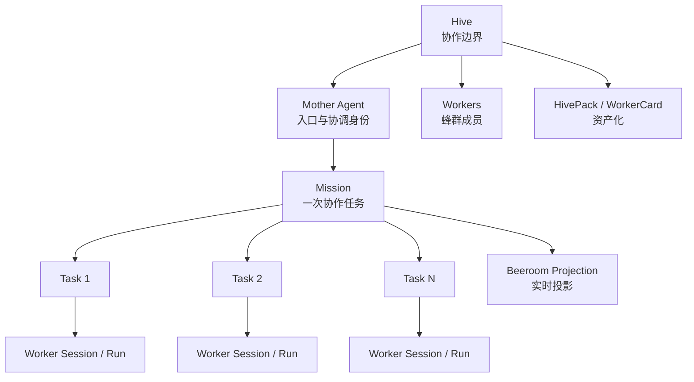
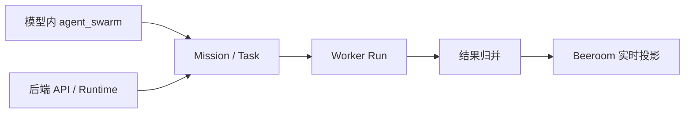
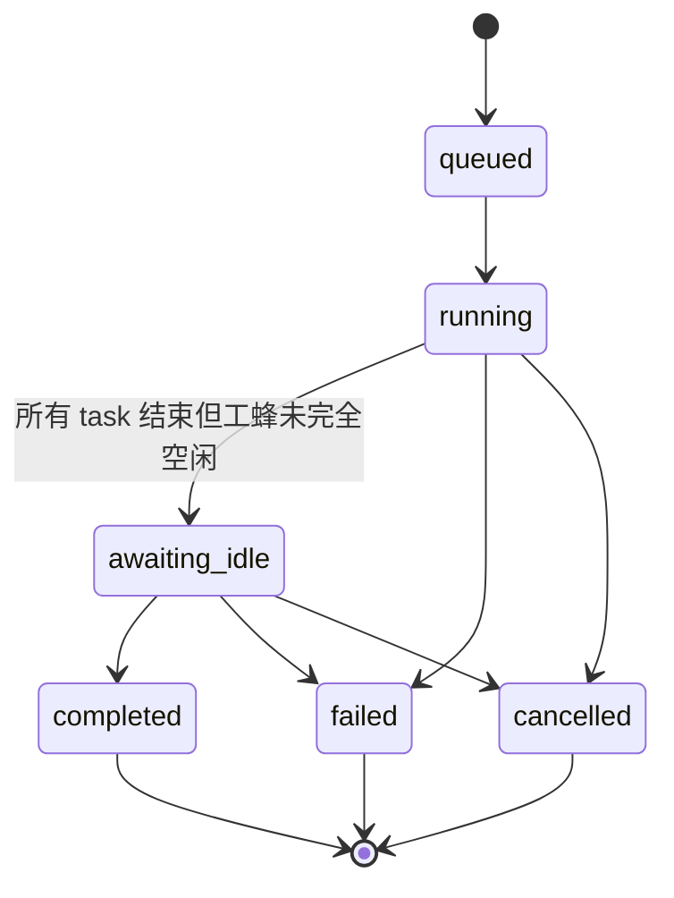
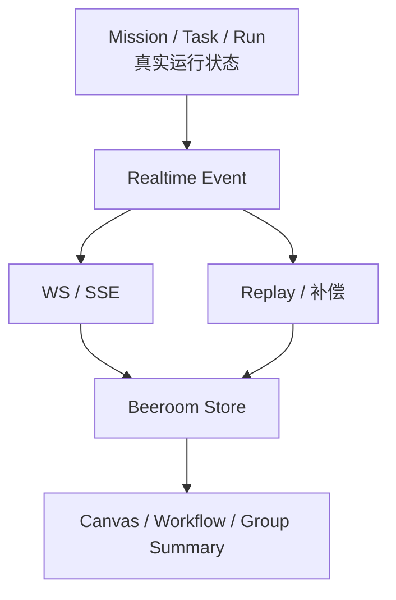
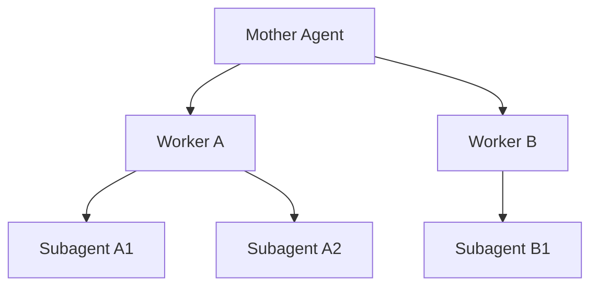

# 蜂群行为设计

## 1. 定位

wunder 的蜂群不是“多开几个智能体一起跑”，而是一套有明确边界的协作系统：

- `Hive` 是协作边界
- `Mother Agent` 是入口身份
- `Mission` 是一次协作任务
- `Worker` 是任务执行者
- `Beeroom` 是运行过程的可视化投影

核心目标只有一句话：

> 让多智能体协作既能并发执行，又不破坏线程稳定性，还能被实时观察、回放、迁移和治理。

---

## 2. 总体结构

这个结构里最关键的是四层分离：

| 层 | 含义 | 不能做什么 |
| --- | --- | --- |
| 协作边界层 | Hive，定义成员范围 | 不能代替线程 |
| 运行态层 | Mission / Task / Run，定义真实执行 | 不能直接等于 UI |
| 投影层 | Beeroom，定义展示与回放 | 不能充当事实源 |
| 资产层 | HivePack / WorkerCard，定义迁移与分发 | 不能直接授予运行权限 |

---

## 3. 设计原理

## 3.1 Hive 是边界，不是线程

Hive 的职责是限定“谁可以协作”，而不是承载执行本身。

这意味着：

- 调度必须先进入某个 hive
- 工蜂必须属于同一个 hive
- 母蜂也只能在这个 hive 的边界内生效
- 真正执行任务的是线程和运行实例，不是 hive 本身

## 3.2 Mother Agent 是身份位，不是调度器对象

母蜂的本质作用是：

- 作为蜂群入口
- 作为默认协调者
- 作为 UI 中的母蜂节点
- 作为 mission 的归属身份锚点

它不是独立的调度线程，不是单独的 runtime worker，也不是一个特殊的数据库实体。  
真正调度任务的是两条执行链：

- 模型调用工具时的即时调度链
- 后端 runtime 的统一调度链

## 3.3 主线程必须稳定，不能漂移

这是蜂群设计最重要的约束。

智能体一旦有显式主线程绑定，这个绑定就是它的一等现实状态。蜂群不能为了“方便派工”随意把历史线程提升为主线程，也不能把一次临时协作线程反向污染成智能体的永久主线程。

因此默认行为必须是：

- 主线程存在就尊重主线程
- 主线程不存在才创建主线程
- 蜂群派工默认新建干净线程
- 只有调用方显式指定目标线程时才允许复用

## 3.4 工蜂协作优先保持上下文干净

蜂群不是把所有工蜂都拖进同一大上下文里，而是把任务拆成多个局部执行单元。  
每个工蜂拿到的是：

- 最小蜂群上下文
- 当前任务说明
- 自己的线程执行空间

这样做的好处是：

- 降低提示词污染
- 降低线程串味
- 降低上下文膨胀
- 保持工蜂结果可独立归并

## 3.5 投影必须服从事实源

Beeroom 可以很炫，但它不是事实源。

真正可信的事实是：

- mission 是否存在
- task 是否完成
- run 是否成功
- agent 是否仍在活跃执行

而 Beeroom 只是把这些事实投影成：

- 蜂巢列表
- 画布节点
- 工作流步骤
- 实时状态灯

所以系统必须支持：

- 实时广播
- 断线回放
- 事件补偿
- 全量重拉

---

## 4. 核心约束

| 约束 | 含义 | 设计意图 |
| --- | --- | --- |
| 同 hive 约束 | 工蜂调度不能跨 hive | 保持协作边界清晰 |
| 母蜂稳定约束 | 母蜂是 hive 的入口位，不应每次任务重选 | 保持群体身份稳定 |
| 主线程冻结约束 | 主线程绑定后不允许随意漂移 | 保持智能体现实状态稳定 |
| 派工新线程约束 | 蜂群默认派到干净线程 | 保持上下文干净 |
| 投影非事实约束 | UI 状态必须服从 durable 状态 | 避免 UI 误导业务 |
| 资产与运行分离 | WorkerCard/HivePack 只描述，不直接授权 | 避免协议污染运行时治理 |

可以把这些约束理解成三条底线：

1. 不越界
2. 不串味
3. 不混层

---

## 5. 执行模型

当前蜂群存在两条执行链，但共享同一套任务语义。

## 5.1 即时调度链

适合“母蜂当前回合直接点兵派工”。

特征：

- 由模型主动发起
- 可以单发，也可以批量发
- 任务一创建就立即调度
- 更像即时协作工具

## 5.2 Runtime 调度链

适合“系统或前端直接创建一个 mission，让后端统一调度”。

特征：

- 由后端接管并发和执行节奏
- 统一做排队、重试、取消、归并
- 更像正式任务系统

## 5.3 两条链的统一点

虽然入口不同，但最终都要落到同一套语义对象：

- 一个 mission
- 多个 task
- 每个 task 对应自己的 run
- 全部结果回收到同一个 mission

这保证了：

- 观测统一
- 投影统一
- 治理统一

---

## 6. 状态模型

## 6.1 Mission 的真实状态不是“任务结束”而是“协作完成”

一个 mission 不只是 task 全部结束就算结束，还要考虑工蜂是否真正退出活跃状态。

因此 mission 当前应区分三种关键阶段：

- `running`：任务仍在执行
- `awaiting_idle`：task 已结束，但工蜂还未完全空闲
- `completed/failed/cancelled`：协作真正收束

这里 `awaiting_idle` 很重要，它表达的是：

> 任务结果可能已经产出，但协作现场还没有完全收口。

## 6.2 Task 的状态只负责描述单工蜂执行

Task 的责任范围应该被严格限制在：

- 派给谁
- 跑在哪个线程
- 对应哪次执行
- 当前结果如何

Task 不应该承担：

- 群体级归并结论
- UI 投影视图
- 资产导入导出语义

## 6.3 Agent 活跃态不能只看 task

工蜂是否空闲，不应该只看 task terminal。  
因为现实中还可能存在：

- session lock
- 正在运行但尚未完全退出的会话
- 子智能体尾部收口

所以 agent 的活跃态必须是运行时视角，而不是任务表字段视角。

---

## 7. 为什么 Beeroom 必须是投影

Beeroom 被设计成投影，而不是事实源，原因有三个：

### 7.1 UI 会断线

如果只依赖内存广播，一旦页面刷新或连接 lagged，蜂群状态就会失真。

### 7.2 UI 需要做增量拼装

前端会根据事件流临时拼出：

- mission 卡片
- task 工作流
- 子智能体节点

这些都不是 durable 原始对象。

### 7.3 真实运行态必须可回放

蜂群协作不是普通聊天，必须支持：

- 回看
- 排障
- 对账
- 补偿同步

因此正确关系必须是：

> 后端真实状态先存在，前端画面只是它的解释图。

---

## 8. 子智能体在蜂群中的位置

当前 wunder 的蜂群不是单层 fanout，而是两层协作：

这说明蜂群中的工蜂并不是“最底层执行原子”，它仍然可以继续拆分。

这里必须坚持一个边界：

- 蜂群 durable 主对象仍然是 mission/task
- 子智能体更多是工蜂内部执行结构
- 前端可以投影 subagent，但不应让 subagent 反过来污染蜂群核心模型

换句话说：

> 工蜂可以继续分工，但蜂群的主账本仍然只记到 mission/task 这一层。

### 8.1 蜂群与子智能体不是同一个概念

二者都属于“智能体协作”，但语义层级不同：

| 维度 | 蜂群 `agent_swarm` | 子智能体 `subagent_control` |
| --- | --- | --- |
| 协作目标 | 调用 hive 内已存在的工蜂做并发分工 | 在当前智能体内部继续细分执行 |
| 参与者来源 | 现有 worker / member | 由当前调用者派生的 child |
| durable 主账本 | `mission / task / run` | 父线程 + 子 session/run metadata |
| 对父线程的影响 | 母蜂继续留在自己的主线程，只新增工蜂任务 | 父线程继续留在自己的主线程，只挂出子智能体分支 |
| 新线程语义 | 工蜂必须新建干净主线程 | 子智能体创建派生子线程，但不改写父智能体主线程绑定 |
| 结果回收位置 | 汇总回 mission，再由母蜂归并 | 直接回到父线程当前回合 |
| 前端投影 | `母蜂 -> 工蜂` | `调用者 -> 子智能体` |

因此系统必须避免两种混淆：

- 不能把蜂群工蜂误当成子智能体卡片。
- 不能把子智能体派生误记成 mission/task 的新工蜂派工。

### 8.2 正确的嵌套关系

允许存在以下三种合法结构：

1. 用户 -> 母蜂主线程 -> `agent_swarm` -> 工蜂新主线程
2. 用户 -> 某智能体主线程 -> `subagent_control` -> 子智能体派生线程
3. 用户 -> 母蜂主线程 -> `agent_swarm` -> 工蜂新主线程 -> `subagent_control` -> 工蜂自己的子智能体

第三种情况最容易被前后端搞混，但它的真实含义是：

- 蜂群只负责把任务派到工蜂。
- 工蜂内部如果再调用子智能体，那是工蜂自己的内部执行细化。
- 这不会把蜂群 durable 模型从 `mission/task` 变成“多层 task 树”。

也就是说，蜂群和子智能体是“可嵌套，但不互相替代”的关系。

### 8.3 线程语义必须明确

这部分是实现时最不能模糊的纪律：

- 用户在蜂群页面右侧栏继续和母蜂对话时，消息必须进入母蜂当前主线程，而不是新开母蜂线程。
- 只有母蜂通过 `agent_swarm` 派出的工蜂，才要求强制新建干净主线程。
- 子智能体无论由母蜂还是工蜂创建，都只能作为“当前调用者的派生执行分支”，不能反向改写调用者的主线程绑定。
- 工蜂完成后，mission/task 终态要等工蜂真正空闲和结果归并完成；子智能体完成后，则只需要把结果回收到它的父线程。

### 8.4 前端投影规则

为了让 Beeroom 画布和右侧栏不混淆，前端应当遵守同一套投影语义：

- `agent_swarm` 只产生 `母蜂 -> 工蜂` 的派工动画和工蜂节点活跃状态。
- `subagent_control` 才产生“某张智能体卡片继续派生子智能体卡片”的动画。
- 如果工蜂内部再创建子智能体，画布应显示为 `母蜂 -> 工蜂 -> 子智能体`，而不是额外从母蜂再长出一个错误子卡。
- 右侧栏主消息流以主线程会话为准；子智能体消息属于派生协作消息，不应篡改母蜂/工蜂本身的线程身份。

一句话总结：

> 蜂群负责“把任务交给谁”，子智能体负责“当前执行者如何继续拆分”；二者可以串联，但绝不能共用同一套线程语义和前端投影规则。

---

## 9. 资产化原则

HivePack 和 WorkerCard 的意义，不是“让某个蜂群直接运行”，而是“让一组蜂群能力可迁移、可复用、可分发”。

因此资产层应只做两件事：

- 描述
- 迁移

不应做两件事：

- 直接授予运行权限
- 直接决定运行时调度策略

这条边界非常关键。  
否则系统会很快退化成：

- 配置协议和运行协议混在一起
- 导入文件直接影响运行时权限
- 蜂群迁移变成运行时副作用注入

---

## 10. 当前实现最值得保留的思想

如果只保留最核心的设计价值，当前蜂群实现最值得保留的是以下五点：

### 10.1 协作边界与线程边界分离

Hive 负责边界，线程负责执行，这个分层是对的。

### 10.2 主线程现实状态被保护

不会为了临时协作去破坏智能体长期主线程，这是对的。

### 10.3 派工默认走干净线程

这让蜂群协作更像真正的分工，而不是在一锅上下文里搅拌，这是对的。

### 10.4 投影层和事实层被区分

Beeroom 只是投影，这个认知必须继续坚持。

### 10.5 资产协议与运行协议被分离

HivePack/WorkerCard 是资产，不是运行时授权对象，这个方向是对的。

---

## 11. 当前最需要警惕的问题

## 11.1 状态词汇仍不够统一

当前运行态、汇总态、投影态使用的状态词有重叠但不完全一致，后续应统一成：

- durable 状态一套
- projection 状态一套
- 二者显式映射

而不是让不同入口自然生长。

## 11.2 Mother Agent 仍偏“身份概念”

目前母蜂更像入口位，而不是强语义协调器。后续若要继续强化蜂群，需要决定：

- 母蜂是否负责任务分解
- 母蜂是否负责结果归并
- 母蜂是否负责协作策略选择

## 11.3 子智能体投影会继续增加复杂度

只要前端继续展示 worker 下的 subagent，系统就必须持续防止：

- durable 核心模型被 UI 反向侵入
- 子智能体状态直接替代 mission/task 状态

---

## 12. 最终设计判断

wunder 蜂群的正确抽象不是“多智能体一起干活”，而是：

> 在同一个 hive 边界内，由母蜂身份组织多个已有工蜂，以 mission/task 作为主账本，以 session/run 作为执行载体，以 beeroom 作为实时投影，以 HivePack/WorkerCard 作为资产封装的分层协作系统。

这套设计如果继续演进，最应该坚持的不是功能堆叠，而是三条纪律：

1. 边界纪律：Hive 不越界，工蜂不跨群
2. 线程纪律：主线程不漂移，派工线程要干净
3. 分层纪律：事实归事实，投影归投影，资产归资产

只要这三条纪律不破，蜂群功能可以继续扩展；一旦破坏，系统会很快退化成混乱的“多线程聊天 UI”。
