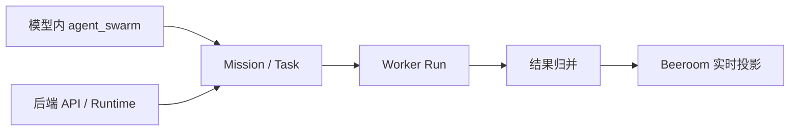
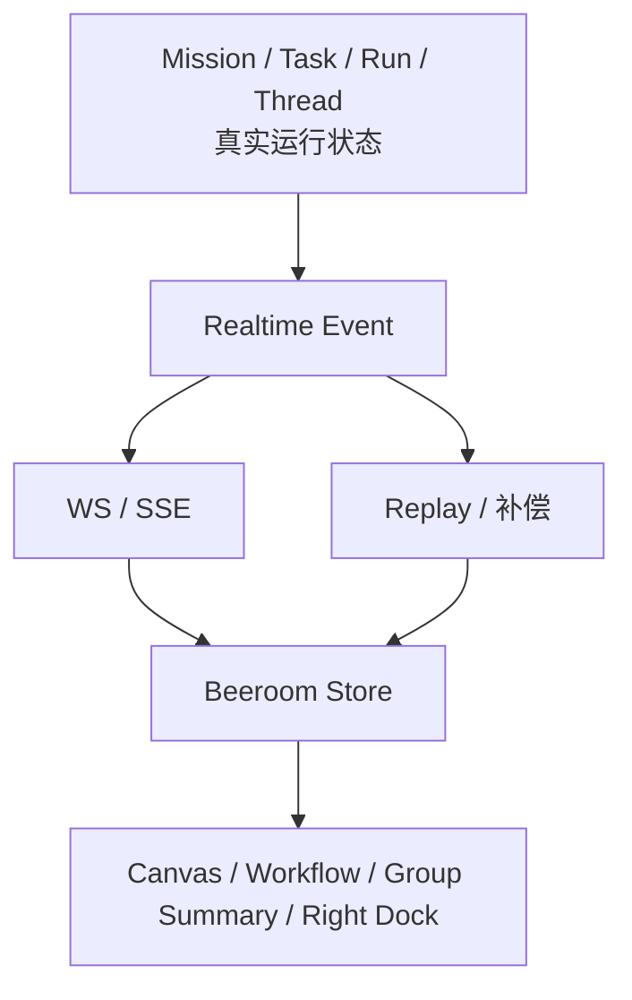
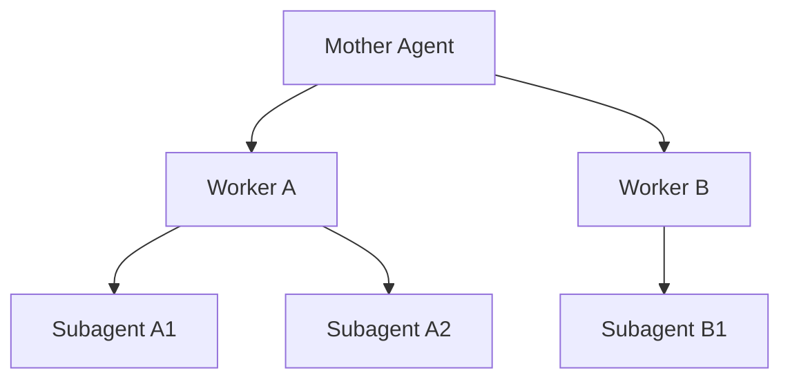

# 蜂群行为设计

> 本文描述 wunder 当前蜂群系统的行为边界、线程语义、运行账本、前端投影原则，以及与工蜂卡 / 蜂群包 / 子智能体体系之间的关系。本文以当前实现为准，不再保留已过时的“默认派工新建干净线程”等旧结论。

---

## 1. 定位

wunder 的蜂群不是“把多个智能体一起拉进一个大上下文”，而是一套有清晰边界的协作系统：

- `Hive` 是协作边界
- `Mother Agent` 是蜂群入口身份
- `Mission / Task / Run` 是真实运行账本
- `Worker` 是任务执行者
- `Beeroom` 是运行态投影
- `HivePack / WorkerCard` 是资产封装

核心目标只有一句话：

> 让多个智能体在同一个 hive 边界内稳定协作，并且可实时观察、可回放、可迁移、可治理，而不会破坏各智能体自身的主线程现实状态。

---

## 2. 分层模型

四层必须分离：

| 层 | 含义 | 不能做什么 |
| --- | --- | --- |
| 协作边界层 | Hive，限定谁可以协作 | 不能替代线程和运行态 |
| 运行态层 | Mission / Task / Run，记录真实执行 | 不能直接等同于 UI |
| 投影层 | Beeroom，负责展示、回放、交互绑定 | 不能充当事实源 |
| 资产层 | HivePack / WorkerCard，负责封装与迁移 | 不能直接授予运行权限 |

---

## 3. 核心原则

### 3.1 Hive 是边界，不是线程

Hive 的职责是限定“哪些智能体可以互相协作”，而不是承载执行本身。

因此：

- 调度必须先进入某个 hive
- 工蜂必须属于同一个 hive
- 母蜂也只在这个 hive 的边界内生效
- 真正执行任务的是 session / run，而不是 hive 本身

### 3.2 Mother Agent 是入口身份，不是特殊 runtime 对象

母蜂的本质作用是：

- 作为蜂群入口
- 作为默认协调者
- 作为 Beeroom 里的母蜂节点
- 作为 mission 的归属身份锚点

它不是独立的数据模型，也不是高于其它智能体的一类特殊线程。真正负责执行的是 session / run，母蜂只是“谁在组织这次协作”的身份位。

### 3.3 主线程必须稳定，但默认派工已改为复用主线程

智能体一旦存在显式主线程绑定，这个绑定就是它的一等现实状态。蜂群不能为了派工方便随意把别的历史线程提升成主线程，也不能让子智能体反向污染调用者的主线程。

当前实现下的默认行为是：

- 主线程存在就复用主线程
- 主线程不存在才创建并绑定主线程
- `agent_swarm` 默认把任务落到工蜂当前主线程
- 只有显式传入 `threadStrategy=fresh_main_thread` 时，才强制创建新的干净线程并重绑为工蜂主线程
- 显式提供 `sessionKey` 时，优先复用指定线程

这意味着“主线程现实状态稳定”依然成立，但“蜂群派工默认走干净线程”已经不是当前结论。

### 3.4 工蜂协作优先保持局部上下文，而不是强制新线程

蜂群的目标不是把所有工蜂塞进一个大共享上下文，而是把任务拆成多个局部执行单元。

当前实现通过以下方式保持局部性：

- 每个工蜂有自己独立的主线程现实状态
- 蜂群任务默认落在工蜂自己的主线程，而不是母蜂线程
- 如需清空上下文，可以显式切到 `fresh_main_thread`
- 工蜂内部再调用子智能体时，走的是该工蜂自己的派生分支

所以现在的局部性来源是“线程归属清晰”，而不是“默认每次新建线程”。

### 3.5 投影必须服从事实源

Beeroom 可以很鲜活，但它不是事实源。

真实可信的事实是：

- mission 是否存在
- task 是否完成
- run 是否成功
- agent 是否仍处于活跃执行态
- agent thread 是否仍绑定到某个 session

Beeroom 只是把这些事实投影成：

- 蜂群列表
- 画布节点
- 右侧栏消息流
- workflow 轨迹
- 群摘要

因此系统必须同时支持：

- 实时广播
- 断线回放
- 事件补偿
- 全量重拉

---

## 4. 当前行为约束

| 约束 | 当前含义 | 设计意图 |
| --- | --- | --- |
| 同 hive 约束 | 工蜂只能在当前 hive 内被发现与派工 | 保持边界清晰 |
| 母蜂身份锚点 | 母蜂是蜂群入口身份，不应在一次次任务中漂移 | 保持蜂群身份稳定 |
| 主线程稳定约束 | 主线程一旦绑定，不允许被历史线程或子线程随意覆盖 | 保持智能体现实状态稳定 |
| 默认主线程派工约束 | 蜂群默认复用工蜂主线程，仅在显式 `fresh_main_thread` 时新建干净线程 | 减少线程漂移，保留显式重置能力 |
| 投影非事实约束 | UI 状态必须服从 mission / task / run / thread 事实 | 避免 UI 误导业务 |
| 资产与运行分离 | WorkerCard / HivePack 只描述，不直接授权 | 避免协议污染运行时治理 |

可以把这些约束理解成三条底线：

1. 不越界
2. 不串味
3. 不混层

---

## 5. 运行模型

蜂群当前有两条入口链路，但共享同一套任务语义：

### 5.1 `agent_swarm` 即时派工链路

适合“母蜂在当前轮次内直接派工”。

特征：

- 由模型主动发起
- 可以单发，也可以批量发
- 任务创建后立即调度
- 默认复用工蜂主线程
- 可显式切换到 `fresh_main_thread`

### 5.2 Runtime / API 派工链路

适合前端或后端系统直接创建 mission，再让 runtime 统一调度。

特征：

- 后端统一接管并发、重试、取消、归并
- 使用同一套 mission / task / run 模型
- 更像正式任务系统

### 5.3 两条链路的统一点

无论入口如何不同，最终都要落到同一套语义对象：

- 一个 mission
- 多个 task
- 每个 task 对应自己的 run / worker session
- 所有结果回收到同一个 mission

这样才能保证：

- 观测统一
- 投影统一
- 治理统一

---

## 6. 状态模型

### 6.1 Mission 的完成，不等于 task 全部 terminal

Mission 不只是“所有 task 都结束”，还要考虑：

- 工蜂是否真正空闲
- run 结果是否完成归并
- 右侧栏与画布是否已经收到可回放事实

因此 mission 至少应区分：

- `running`
- `awaiting_idle`
- `completed / failed / cancelled`

### 6.2 Task 只描述单工蜂执行

Task 负责记录：

- 派给谁
- 跑在哪条线程
- 对应哪次 run
- 当前结果如何

Task 不应承载：

- 群体级归并结论
- UI 投影
- 资产导入导出语义

### 6.3 Agent 活跃态不能只看 task

工蜂是否空闲，不能只看 task terminal。

还必须考虑：

- session lock
- 主线程是否仍在执行
- 子智能体尾部收口
- 运行态是否已完全退出

因此 agent 的活跃态本质上是运行时视角，而不是单纯表字段视角。

---

## 7. Beeroom 投影原则

Beeroom 被设计成投影，而不是事实源，原因有三个：

### 7.1 UI 会断线

如果只依赖前端内存状态，刷新或弱网就会导致蜂群状态失真。

### 7.2 UI 会做增量拼装

前端会临时拼出：

- mission 卡片
- task workflow
- 工蜂状态
- 子智能体投影

这些都不是 durable 原始对象。

### 7.3 真实运行态必须可回放

蜂群不是普通聊天，必须支持：

- 回看
- 对账
- 排障
- 补偿同步

一句话总结：

> 后端真实状态先存在，前端画面只是它的解释图。

---

## 8. 蜂群与子智能体的边界

蜂群不是单层 fanout，而是允许工蜂继续细分执行：

但必须坚持一个边界：

- 蜂群 durable 主对象仍然是 `mission / task / run`
- 子智能体更多是工蜂内部的执行细化
- 前端可以投影 subagent，但不能让 subagent 反向污染蜂群核心模型

### 8.1 两者不是一个概念

| 维度 | 蜂群 `agent_swarm` | 子智能体 `subagent_control` |
| --- | --- | --- |
| 协作目标 | 调用 hive 内已存在工蜂做并发分工 | 在当前智能体内部继续细分执行 |
| 参与者来源 | 已有 worker / member | 当前调用者派生的 child |
| durable 主账本 | `mission / task / run` | 父线程 + 子 session/run metadata |
| 对父线程影响 | 母蜂继续留在自己的主线程，只新增工蜂任务 | 父线程继续留在自己的主线程，只挂出子分支 |
| 线程语义 | 默认复用工蜂当前主线程，可显式切到 `fresh_main_thread` | 创建派生子线程，但不改写调用者主线程 |
| 结果回收位置 | 汇总回 mission，再由母蜂归并 | 直接回到父线程当前回合 |
| 前端投影 | `母蜂 -> 工蜂` | `调用者 -> 子智能体` |

### 8.2 合法嵌套关系

允许存在以下三种结构：

1. 用户 -> 母蜂主线程 -> `agent_swarm` -> 工蜂主线程（默认）
2. 用户 -> 某智能体主线程 -> `subagent_control` -> 子智能体派生线程
3. 用户 -> 母蜂主线程 -> `agent_swarm` -> 工蜂主线程（默认） -> `subagent_control` -> 工蜂自己的子智能体

第三种最容易被混淆，但真实语义是：

- 蜂群只负责把任务派给工蜂
- 工蜂内部若再调用子智能体，那是工蜂自己的执行细化
- 这不会把蜂群 durable 模型从 `mission/task` 变成“多层 task 树”

### 8.3 当前线程语义

这一部分是实现时最不能模糊的纪律：

- 用户在蜂群页面右侧栏继续和母蜂对话时，消息必须进入母蜂当前主线程
- `agent_swarm` 默认复用工蜂当前主线程；若主线程不存在，则先创建并绑定
- 只有显式传入 `threadStrategy=fresh_main_thread` 时，工蜂才会切到新的干净线程
- 子智能体无论由母蜂还是工蜂创建，都只能作为“当前调用者的派生执行分支”，不能反向改写调用者主线程绑定
- 工蜂完成后，mission / task 的终态要等结果归并和空闲态都收口完成

### 8.4 当前前端投影规则

为了让 Beeroom 画布和右侧栏不混淆，前端应遵守同一套投影语义：

- `agent_swarm` 产生的是 `母蜂 -> 工蜂` 的派工关系
- `subagent_control` 产生的是“某个执行者继续派生子智能体”的分支关系
- 如果工蜂内部再创建子智能体，画布应显示为 `母蜂 -> 工蜂 -> 子智能体`
- 右侧栏主消息流以主线程消息为准；子智能体消息属于派生协作消息
- `silent=true` 的工蜂消息默认不进入聊天页中栏和蜂群右侧消息栏主流展示

---

## 9. 母蜂与静默规则

### 9.1 母蜂的确定顺序

当前实现中，母蜂的确定顺序应理解为：

1. 显式绑定的 `mother_agent_id`
2. mission / group 中已存在的母蜂元数据
3. 第一个 `prefer_mother=true` 的工蜂
4. 兜底成员

这意味着 `prefer_mother` 是“默认母蜂候选”，不是“强制覆盖显式母蜂配置”。

### 9.2 静默不是禁用

`silent=true` 的含义是：

- 默认不出现在消息中栏
- 默认不出现在蜂群右侧消息栏主流消息中
- 仍然可以作为蜂群成员参与 mission / task / run
- 不等于禁用、不等于移出 hive、不等于不可被母蜂派工

静默是投影层规则，不是运行权限规则。

---

## 10. 资产化原则

HivePack 和 WorkerCard 的意义，不是“让某个蜂群直接运行”，而是“让一组蜂群能力可迁移、可复用、可分发”。

因此资产层只做两件事：

- 描述
- 迁移

不应做两件事：

- 直接授予运行权限
- 直接决定运行时调度策略

但是资产层可以声明默认协作意图。当前实现已经允许以下声明进入资产：

- `WorkerCard.runtime.silent`
- `WorkerCard.runtime.prefer_mother`
- `HivePack` 工蜂级 `role / duty`

当前约定：

- `prefer_mother=true` 导出到 `HivePack` 时，`role / duty` 应归一成 `mother`
- 若导入对象仅有 `role=duty=mother`，可反推为默认母蜂候选
- 这些字段都只是配置意图，不直接授予权限

---

## 11. 当前实现最值得保留的结论

### 11.1 边界层与线程层已分离

Hive 负责边界，线程负责执行，这个方向是对的。

### 11.2 主线程现实状态被保护

不会为了临时协作去破坏智能体长期主线程，这是对的。

### 11.3 默认主线程复用比默认新线程更符合“现实状态优先”

当前默认派工改成复用工蜂主线程后，蜂群行为更接近“唤起现有工蜂工作”，而不是“每次都造一个临时人格分身”，这个方向更符合当前系统的一等现实状态设计。

### 11.4 投影层与事实层被区分

Beeroom 只是投影，这个认知必须继续坚持。

### 11.5 资产协议与运行协议仍然分离

HivePack / WorkerCard 是资产，不是运行时授权对象，这个方向是对的。

---

## 12. 仍需持续警惕的问题

### 12.1 状态词汇必须持续统一

durable 状态、projection 状态、摘要状态仍然容易长歪。后续需要继续保证：

- durable 状态一套
- projection 状态一套
- 两者映射显式

### 12.2 母蜂仍是“身份位”而非强语义调度器

当前母蜂更像入口位。若未来继续强化蜂群，需要继续决定：

- 母蜂是否负责任务分解
- 母蜂是否负责结果归并
- 母蜂是否负责协作策略选择

### 12.3 子智能体投影复杂度仍会持续上升

只要前端继续展示 worker 下的 subagent，就必须持续防止：

- durable 核心模型被 UI 反向侵入
- 子智能体状态直接替代 mission / task 状态

---

## 13. 最终判断

wunder 蜂群的正确抽象不是“多个智能体一起干活”，而是：

> 在同一个 hive 边界内，由母蜂身份组织多个已有工蜂，以 mission/task 作为主账本，以 session/run 作为执行载体，以 beeroom 作为实时投影，以 HivePack/WorkerCard 作为资产封装，并允许工蜂继续派生子智能体但不破坏主线程现实状态的分层协作系统。

这套设计如果继续演进，最应该坚持的不是堆功能，而是三条纪律：

1. 边界纪律：hive 不越界，工蜂不跨 hive
2. 线程纪律：主线程不漂移，默认派工尊重工蜂当前主线程，显式新线程才新建干净线程
3. 分层纪律：事实归事实，投影归投影，资产归资产

只要这三条纪律不破，蜂群能力就可以继续扩展；一旦破坏，系统就会很快退化成混乱的“多线程聊天 UI”。
