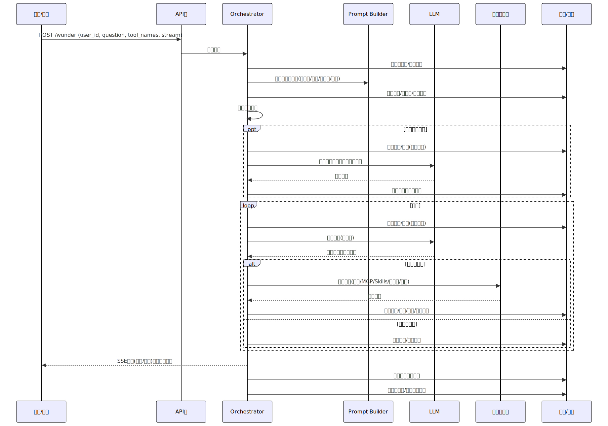

# 智能体调度平台的设计与实现——以 Wunder 为例

## 摘要
随着大模型逐步成为通用智能底座，面向复杂任务的“智能体 + 工具编排”正成为生产系统的主流形态。但在真实场景中，模型能力、工具协议、并发访问、上下文膨胀、安全隔离与可观测性之间存在显著矛盾。本文以 Wunder 智能体调度平台为对象，系统性阐述其设计与实现过程。平台基于 Rust/Axum 构建统一入口 `/wunder`，支持 SSE 流式与非流式交互，提供 MCP、Skills、知识库、自建/共享工具的统一编排；通过 Orchestrator 实现多轮工具调用与任务调度；结合多用户工作区、上下文压缩、长期记忆、监控与性能评估等能力形成完整工程化闭环。本文从需求分析、总体架构、核心流程、关键算法、数据与安全、性能评估与运维实践等方面进行深入分析，聚焦系统方法与实现机理，为同类智能体平台的工程落地提供可复用思路。

## 关键词
智能体调度；工具编排；多模型适配；MCP；SSE；上下文压缩；多用户工作区；A2A

## 1 引言
大模型在对话生成、规划推理与代码生成方面已具备强大能力，但单纯的模型生成难以覆盖真实业务中“需要外部能力、可验证结果、长链路协作”的需求。智能体系统通过工具调用将模型能力与外部世界连接，逐步形成“模型推理—工具执行—结果回填—再次推理”的闭环。然而，当工具来源多样（内置工具、MCP、技能包、知识库、自建工具等）且运行环境面向多用户并发时，传统“单一入口 + 简易工具表”的方案很难满足工程化要求。

近年来 LLM 智能体研究与实践快速发展，综述工作系统梳理了智能体框架、应用与评测方法[1]；ReAct、Toolformer 等方法推动了“推理—行动”结合与工具学习能力[2][3]；同时开源生态如 LangChain、AutoGPT 也加速了工程化落地[9][10]。这些进展表明，智能体能力已从单模型生成转向“模型 + 工具 + 环境”的系统化协作。

Wunder 的设计目标是构建一个“智能体调度平台”：对开发者而言一切是接口（API/配置/工具），对模型而言一切皆工具（可调用、可组合、可治理）。平台需要在多模型、工具治理、并发隔离、上下文压缩、监控评估与安全策略之间取得平衡，并能够长期稳定运行。本文将展示 Wunder 在这些维度的系统设计思路与具体实现。

## 2 背景与挑战
### 2.1 多工具异构与协议割裂
现代智能体系统往往同时依赖本地工具、外部服务、技能流程和知识库。工具接口协议（文本标签、函数调用、JSON-RPC 等）差异明显，若缺乏统一抽象，将造成“模型无法稳定调用”“工具不可治理”的问题。

### 2.2 上下文膨胀与成本压力
随着多轮对话与工具调用积累，上下文 token 数持续增长，导致推理成本上升与响应延迟增大。既要保证对话连续性，又要控制上下文预算，是核心难题。

### 2.3 并发与隔离需求
智能体平台通常服务多个用户与多个会话，若缺乏并发控制与隔离机制，会导致资源争用、误用他人工作区或跨用户数据泄露。

### 2.4 可观测性与可运维性
生产系统需要定位错误、回放过程、测量性能与质量；同时应具备可取消任务、可追踪工具调用与资源占用的能力。

### 2.5 相关工作与行业现状
智能体研究已形成较为清晰的系统谱系。综述研究总结了 LLM 智能体的核心构成、典型应用与评测方法，为工程化系统提供了统一框架视角[1]。方法层面，ReAct 强调推理与行动交织以提升任务可解释性与成功率[2]；Toolformer 展示了模型通过少量示例自学习工具调用的能力[3]。在长期记忆与上下文扩展方面，Generative Agents 的“观察—计划—反思”架构与 MemGPT 的分层记忆管理思想，为长会话与持续交互提供了可借鉴范式[4][5]。评测方面，ToolBench 与 AgentBench 等基准开始量化工具使用与复杂环境中的智能体表现，揭示了工具稳健性与长链路决策的真实短板[6][7]。

产业实践同样快速演进。开源项目 AutoGPT 探索“多轮规划 + 工具执行”的端到端流程[10]，LangChain 等框架提供可组合的代理抽象与工具生态，降低了工程落地门槛[9]。研究与产业生态共同表明，智能体能力瓶颈已从单模型推理转向“工具治理、上下文管理、并发与可观测性”等系统工程问题[1][6][7]，这也是本文围绕 Wunder 进行系统设计的现实背景。

### 2.6 业界平台对比与定位
从产业实践看，Dify、Coze 等平台代表了“应用层智能体”的方向：强调可视化流程编排与低门槛配置，将模型、知识库与插件能力封装成可快速上线的产品形态。这类平台往往提供统一的工作台、可复用的应用模板与多渠道发布能力，使组织能够在短周期内完成试验与迭代。其优势在于产品化效率，但在复杂多工具协作、长链路任务治理与多用户隔离方面，往往需要更深入的系统性支撑。

公开资料显示，Dify 将自身定位为开源的 LLM 应用开发平台，并强调 agentic workflows、RAG、模型管理与可观测能力[14]；Coze 的官方页面将其描述为 AI Agent-based 的智能办公平台，强调 AI 写作、PPT 生成、Web 开发与 AI 设计等一体化生产力工具[18]。这些事实表明应用层平台更关注“快速交付与业务场景封装”，其优势在于产品化效率和平台化分发，而不是对底层调度与长期治理的深耕。

与之相对，LangGraph、AutoGen、CrewAI 等框架更偏向开发者侧，强调可编排的多智能体协作与流程控制，通过图式结构或角色分工把任务拆解为可组合的步骤。这类框架的优势在于灵活性与可塑性，但对工程能力要求较高，且在资源治理、可观测性与长期运行保障方面需要额外建设。

官方文档中，LangGraph 被定义为面向长时间运行、有状态智能体的低层编排框架与运行时，并突出 durable execution、streaming、human-in-the-loop 等底层能力[15]；AutoGen 描述为用于创建可自主或与人协作的多智能体应用框架[16]；CrewAI 则强调其为独立于其他框架的轻量多智能体框架[17]。这些事实显示框架层聚焦“如何组织协作与流程”，但对多用户隔离、工具治理与全链路运维仍需要额外建设。

因此，Wunder 的定位介于两者之间，更接近“调度与治理的基础设施”。它不直接替代应用层的可视化体验，也不局限于框架级的本地编排，而是把工具治理、上下文预算、并发隔离与事件级可观测性抽离为稳定的运行基座，使上层应用与多智能体协作可以长期、可控地运行。对比这些平台可以得到启发：当智能体从“实验性应用”走向“长期运行系统”，真正的差异不在于模型本身，而在于对流程与资源的治理能力是否被显式化并可持续执行，这也是 Wunder 设计中最核心的创新取向。

## 3 需求分析与设计目标
### 3.1 功能需求
平台的功能需求不是简单的功能清单，而是对“如何协同模型与工具”的工作方式进行约束。统一入口与流式交互是第一层要求：/wunder 承担稳定的请求面，使前端与外部系统不必理解内部多模型与多工具的差异；SSE 流式把“思考—行动—反馈”的中间过程可视化，让用户能在延迟较长时仍获得进度感，同时也为监控与回放提供天然事件切片。

第二层要求是多工具统一编排。平台允许内置工具、MCP、Skills、知识库与用户自建工具共存，但调用行为必须可被治理和解释，因此引入统一的工具规格与可选启用机制，通过清单控制启用范围，使“工具是否可用”成为显式策略，而非隐含依赖。这样可以在不同任务场景中快速收敛工具集合，降低模型误用与上下文冗余。

第三层要求是多用户隔离、跨智能体协作与长期演进能力。工作区隔离保证并发场景下的数据安全与资产沉淀；A2A 接口提供跨系统互操作的稳定入口；监控与评估机制则把运行质量从“感觉”变为“可测量”，与长期记忆和上下文压缩配合，维持长链路对话的连续性与经济性。

### 3.2 非功能需求
非功能需求决定平台能否长期稳定运行。并发与可用性方面，平台需要在高峰负载下保持可预测行为，因此采用“同一用户互斥 + 全局并发上限”的双重约束，并确保 SSE 断开不等同于任务失败，降低网络波动对完成率的影响。

可观测性与安全性并不是附加项，而是调度系统的内建能力。通过事件流、系统快照与工具调用统计，运行过程能够被追踪、回放与审计；在安全侧则以权限白名单、路径隔离与沙盒运行形成分层防护，避免工具能力外溢。

可维护性与性能面向长期演进。模块边界清晰、配置可覆盖让系统能够在不破坏主流程的前提下持续扩展；缓存与资源治理让平台在多年运行中仍保持低延迟与可控成本，这也是“十年以上稳定运行”目标的工程化落点。

### 3.3 设计原则
设计原则强调“接口统一、可组合、可治理、稳健高效”的平衡。统一接口让模型与开发者面对的是稳定契约，避免不同工具或模型导致的行为分裂；可组合性保证工具与技能可以像积木一样构建流程，而不是在每次需求变化时重写逻辑。可治理性强调可追踪、可审计、可禁用，使平台在规模化后仍具备管理能力。高效与稳健意味着对上下文、并发与 IO 的约束不只是优化手段，而是保证系统长期可信赖的基础。

## 4 总体架构设计
### 4.1 架构概览
系统总体架构如下图所示，核心分为 API 层、调度引擎、Prompt Builder、LLM 适配、工具执行层、监控与存储等组件。

### 4.2 模块职责划分（概念层）
模块划分强调边界清晰与职责收敛。API 层聚焦“入口统一与协议稳定”，将鉴权、限流与流式输出封装在统一路由中；调度引擎聚焦会话生命周期与多轮推理—工具执行闭环，是系统的“决策中枢”。工具执行层是能力边界，统一封装内置工具与外部工具的调用过程，以减少模型感知的差异。Prompt Builder 承担“认知接口”的角色，将工具规格、技能说明与工作区摘要合成为可被模型理解的上下文，同时通过缓存降低重复构建的成本。监控与存储层保证事件、日志、记忆与评估结果可追踪可回放；工作区层提供文件与资产的隔离与长期沉淀，使多用户环境下的数据互不污染。

### 4.3 运行时边界与依赖
平台依赖 LLM 服务端、MCP 服务端、共享沙盒服务与数据库。配置采取“基础配置 + 覆盖配置”分层，环境变量用于覆盖关键参数（如服务地址、端口、API key、数据库连接串）。在容器化部署中建议使用独立数据库与共享沙盒服务，以降低主服务负担并提升安全性。

## 5 核心流程与接口设计
### 5.1 请求-响应主流程
平台主流程体现“输入—调度—工具—回答”的迭代式闭环，核心是把模型生成与工具执行拆分为可观察、可回放的事件序列。

当请求进入系统后，平台首先建立会话上下文并完成会话级别的互斥与监控注册，确保并发环境下的隔离与可追踪性。随后由 Prompt Builder 将当前问题、历史对话、工具清单与用户工作区摘要整合为模型可理解的上下文，这一步不仅影响生成质量，也决定了后续工具选择的稳定性。

模型输出被视为“可执行意图”。当输出包含工具调用时，调度引擎将其解析为明确的执行计划，完成工具执行与结果回填，再进入下一轮推理；当输出为直接回答时，流程收敛并释放会话锁。通过这种轮次驱动的结构，平台在面对复杂任务时仍能保持可解释性与收敛性。

流式输出是该流程的关键组成。SSE 事件将中间步骤、工具调用与最终答案统一映射为事件流，使前端能够展示进度与细节，同时也为日志与回放提供天然切片，从而实现“可见的推理过程”与“可审计的执行链路”。

这一流程设计的关键在于“决策与执行分离”。模型负责生成意图，系统负责执行与回填，使每一轮都有明确输入与输出，从而把不确定性限制在可追踪边界内。工具失败或重试不会污染对话语义，回放与审计也能基于事件序列复原真实执行链路。

同时，事件流被视为可观察的“事实记录”，前端展示与运维回放共享同一事件语义，避免“可视化过程”和“真实执行过程”出现偏差。对于研究与评测场景，这种结构化流程提供了稳定对象，能够支撑更精细的错误归因与流程优化。

### 5.2 工具管理与注入流程
工具管理流程体现“配置驱动的治理”思路，强调工具清单在进入模型之前完成筛选与规范化。

配置入口不仅定义工具来源，更定义工具的可用范围与权限边界。平台通过统一的工具规格与版本化缓存，将异构工具转化为可治理的清单，再由调度引擎根据任务场景选择合适的工具集合注入提示词或请求体。这样做的目的，是让“可用工具”成为显式策略，避免模型在不适合的场景调用高风险或高成本工具。

工具注入同时承担上下文预算控制的责任。通过在注入前裁剪、去重与合并描述，系统避免工具规格占用过多上下文，从而把预算留给真正影响回答质量的信息。这种流程使工具治理从“工具可用”进一步扩展到“工具可用且可控”。

### 5.3 会话状态机
会话状态机是平台运行的秩序约束，目的是让长链路对话在各种异常情况下仍具备清晰语义。

状态机刻意保持简洁：running 表示正常调度，finished 表示结果可回收，error 表示异常终止，而 cancelling 作为中间态避免了“直接中断”导致的资源泄漏与状态不一致。这样的设计使得取消、超时、断线等情况都能被统一收敛为可识别状态，从而便于运维与审计。

状态机同时是监控与回放的锚点。事件流与日志可以围绕状态变化进行聚合，帮助系统快速定位“在哪个阶段发生了问题”，避免在复杂的多轮调度中迷失问题根因。

### 5.4 主要接口族设计
接口族设计围绕“统一入口、管理面、标准互操作”三条主线展开。/wunder 作为主入口，承担对话与工具编排的统一请求面，同时提供流式与非流式两种交互方式，适配不同系统的集成需求；/wunder/system_prompt 与 /wunder/tools 提供可审计、可调试的入口，使提示词与工具清单成为可观察资产。

管理端接口集中在 /wunder/admin/*，用于模型、工具、MCP 与监控的治理；工作区相关能力集中在 /wunder/workspace/*，确保文件操作与用户隔离保持一致语义。文档解析入口 /wunder/doc2md/convert 与 /wunder/attachments/convert 则建立统一的内容预处理链路，使“知识进入系统”的路径可控且可追踪。

为了与外部智能体生态保持互操作性，平台同时提供 /a2a 的 JSON-RPC 标准入口以及 /.well-known/agent-card.json 的能力发现接口。通过这一组合，Wunder 在保持自身统一入口的同时，能够作为跨系统协作的一部分被发现、调用与编排。

接口族的设计强调语义稳定而非功能堆叠。核心入口表达“任务意图”，管理面表达“治理策略”，工作区接口表达“资源边界”，三者互相独立以避免角色混淆；能力发现接口提供平台自描述性，使外部系统在不理解内部细节的情况下也能接入。这种结构让接口具备可演进性：新增能力更倾向于扩展治理与能力说明，而非破坏已有调用契约。

## 6 工具体系设计与实现
### 6.1 工具类型与命名空间
工具类型与命名空间的目标，是把“来源差异”转化为“可识别的治理边界”。在多来源工具并存时，名称必须同时表达归属与使用边界，因此采用“命名空间 + 工具名”的策略，使调度引擎能够在不理解具体实现的前提下完成路由、权限与统计。

| 工具类型 | 命名形式 | 主要来源 | 典型用途 |
| --- | --- | --- | --- |
| 内置工具 | `工具名` / 英文别名 | 平台内置 | 文件/命令/计划面板 |
| MCP 工具 | `server@tool` | MCP 服务 | 外部服务能力 |
| A2A 服务工具 | `a2a@service` | A2A 配置 | 跨智能体协作 |
| Skills | `skill_name` | 技能包 | 固化流程 |
| 知识库 | `knowledge_base` | 知识库 | 本地检索 |
| 用户自建 | `user_id@tool` | 用户配置 | 个性化扩展 |
| 共享工具 | `owner_id@tool` | 共享配置 | 跨用户复用 |

这种命名策略让工具治理从“能不能调用”扩展为“调用谁、在什么范围调用”，同时也为用户提供直观的选择提示，避免因同名工具造成误用。

### 6.2 工具调用协议与模式
工具调用协议既要兼容多模型，又要保证执行确定性。tool_call 模式通过文本标签表达调用意图，适配那些缺乏结构化函数调用的模型；function_call 模式则通过结构化字段描述工具调用，具有更强的稳定性与可解析性。平台同时支持两者，是为了在真实工程环境中兼顾“兼容性”与“可靠性”。

在调度层面，两种模式最终都被归一化为“工具调用事件”，并通过统一的回填机制进入下一轮推理。这样做的关键价值在于：模型的输出形式可以变化，但系统对工具调用的治理逻辑保持一致，从而降低模型差异对系统行为的影响。

### 6.3 内置工具执行与安全策略
内置工具构成平台的基础能力集合，覆盖文件操作、命令执行、计划面板与最终回复等核心场景。设计上强调“稳定、可预测、可约束”，因此每类工具都对应明确的权限边界与使用规则。工具集合并非越多越好，而是通过明确的命名与权限控制，使模型在需要时精准调用，而非在不确定场景下盲目尝试。

安全策略强调最小权限原则。文件访问通过路径白名单与黑名单划分边界，命令执行则通过白名单限制可执行指令，并支持在共享沙盒环境中运行。这样可以在保持工具可用性的同时，将潜在风险限制在可控范围内，为长期运行提供稳定性保障。

### 6.4 MCP 工具协作
MCP 工具由外部服务提供，平台将其视为“可远程治理的能力扩展”。与本地工具不同，MCP 工具的可用性与延迟具有不确定性，因此平台首先通过缓存工具规格形成稳定的提示词基线，避免每次请求都触发远端发现造成抖动。

在协作机制上，平台将 MCP 工具映射为统一规格，以便与内置工具共用同一调度逻辑，并在调用侧引入超时、限流与失败回退策略。当远端不可用时，系统回退到最近一次可用规格，保证模型看到的工具集不会频繁波动，从而提升整体稳定性与用户体验。工具调用日志记录 server/tool 与延迟，为后续治理与容量规划提供依据。

### 6.5 Skills 与知识库
Skills 被设计为“可复用的流程片段”，它们不是简单的脚本集合，而是带有输入约束、步骤边界与可审计规则的过程知识。通过将技能描述注入提示词，模型能够在理解目的与限制的基础上调用技能，从而降低“工具乱用”与流程漂移的概率。技能的价值在于把经验固化为可迁移的流程，并让不同用户共享同一套稳定的执行逻辑。

知识库则承担“可检索记忆”的角色。平台以结构化 Markdown 作为知识单元，配合元数据与片段置信度，使检索结果可追踪可解释。通过缓存与重排序策略，系统在保证命中率的同时控制检索成本，使知识调用从“开销很大”变为“可持续使用”的能力。

### 6.6 用户自建与共享工具
用户自建与共享工具强调“配置即能力”。用户可以将自定义 MCP、技能或知识库以配置方式挂载到个人空间，而共享并不是复制实现，而是共享配置与可用清单。此设计确保工具复用不破坏隔离边界，并要求被共享工具显式勾选后才能启用，从而在可复用与可控之间取得平衡。

### 6.7 A2A 服务工具
A2A 服务工具以标准接口为核心，解决“跨智能体协作”中的发现与调用问题。通过统一命名与协议，平台能够把外部智能体视作可调用工具，使任务拆解与多智能体协作具备工程可行性。内置的“观察/等待”能力进一步减少跨系统等待的不确定性，使协作链路更可控、更易调试。

## 7 调度引擎设计与实现
### 7.1 资源与并发控制
资源与并发控制决定平台在高负载场景中的稳定性。同一 user_id 互斥执行主要是为了保护工作区与上下文一致性，避免同时执行导致的文件竞争与上下文污染；全局并发上限则防止系统在突发流量下被耗尽资源。该策略兼顾了“单用户体验稳定”与“整体系统可用”，让平台在多用户环境中保持可预测的响应。

并发控制不仅是性能优化，也是公平与一致性的约束。同一用户互斥避免工作区与上下文被并行修改导致的语义漂移；全局上限提供背压，保证系统在高负载下维持可预测的响应曲线。对长期任务而言，这种组合还能减少“长任务占用资源导致短任务饥饿”的风险，使平台具备更稳定的服务质量。

### 7.2 轮次驱动与工具回填
轮次驱动的调度机制使复杂任务能够在“模型—工具—模型”的循环中逐步收敛。每轮输出既可能是直接回答，也可能是工具调用意图，调度引擎将其解析为可执行事件并回填结果，再触发下一轮推理。对 tool_call 与 function_call 的双重支持保证了模型差异不会破坏调度的稳定性。

安全与收敛控制则通过快速终止与轮次数上限提供“快速止损”能力：当任务过度发散或出现异常时，可以在不破坏会话语义的情况下终止流程。这种设计体现了对长链路可控性的重视。

### 7.3 SSE 事件流与持久化
SSE 事件流是平台可观测性的重要基础。平台将模型输出、工具调用、工具结果与最终回答统一为事件序列，使前端与监控系统共享同一视图。当事件队列溢出或网络中断时，事件仍可落库并支持续传，从而避免“看不到过程”或“过程丢失”的问题。

为了控制事件量与存储开销，系统会对连续输出片段进行合并，兼顾实时性与成本。这种“流式可见 + 存储可控”的策略，使平台能够在大规模并发场景中维持稳定的监控能力。

### 7.4 异常处理与取消机制
异常处理与取消机制强调“可恢复与可解释”。模型调用与工具执行均设置超时与错误捕获，确保单点故障不会拖垮全局流程；取消请求通过明确的中间状态逐步收敛，避免直接中断造成资源泄漏或状态错乱。错误信息以结构化方式返回，使前端与运维能够快速定位问题，而不是依赖模糊日志。

### 7.5 调度流程总结
从流程视角看，调度可以概括为“入口校验—会话锁—提示词构建—多轮推理—结果收尾”的闭环。入口校验保证请求与权限一致，会话锁确保上下文一致性，提示词构建决定模型的可解释能力；多轮推理在工具调用与结果回填之间循环，最终以明确的终止原因收敛。

这一流程的关键不在于步骤数量，而在于每一步都有清晰的责任边界与可观测输出，使得复杂任务能够被分解为一系列可追踪的阶段，既便于优化，也便于运维。

## 8 提示词构建与上下文管理
### 8.1 Prompt Builder 与缓存策略
Prompt Builder 被视为“模型认知接口”。它将系统模板、工具清单、技能说明与工作区摘要整合为统一上下文，并通过多层缓存减少重复计算。缓存不仅是性能优化，也是稳定性策略：当工具规格或工作区树未发生变化时，提示词保持一致，避免模型因提示词抖动而产生行为漂移。

在高并发场景下，提示词构建的并发去重同样关键。通过对相同 Key 的请求进行等待合并，系统避免重复拼接与重复 IO，确保性能与一致性兼得。

### 8.2 工具注入与技能提示
工具注入与技能提示的设计目标是“在最小上下文内传递最大可执行信息”。对于 tool_call 模式，工具清单与调用协议被显式注入，以保证模型输出格式稳定；对于 function_call 模式，则尽量简化提示词，把工具结构交由请求参数承载，减少对模型的干扰。技能信息在两种模式下均保留，使模型理解技能边界与输入约束。

当启用结构化 UI 输出能力时，平台会移除“最终回复”工具，以避免模型同时输出结构化 UI 与自然语言回答造成冲突。这体现了提示词注入的一个核心原则：模型应在明确、无歧义的任务空间内决策。

### 8.3 Token 统计与上下文预算
Token 统计强调“上下文占用量”而非计费消耗，是为了把预算管理与系统行为直接绑定。平台采用近似估算策略（如固定 bytes/token 近似），以换取实时性与低开销；对图片等多模态输入采用固定 token 估计，确保预算可控。压缩前移除 reasoning 内容，既降低成本，也避免无关信息挤占上下文。这一策略在速度与精度之间取得平衡，使预算控制成为可操作的工程手段。

在 token 统计策略上，平台更关注“预算上界的稳定性”而不是精确计费。近似估算的意义在于快速给出安全阈值信号，让系统在逼近上限时提前压缩或裁剪，从而避免运行时突然超限带来的失败。这使预算管理成为可操作的控制手段，而不是事后分析的指标。

## 9 历史压缩与长期记忆
### 9.1 历史压缩算法
上下文压缩采用“双阈值触发 + 摘要生成 + 结果回填”的策略，核心流程如下：

该流程的设计逻辑是：当历史消息占用逼近预算或超出安全阈值时，系统先估算可用窗口并裁剪待压缩范围，然后以摘要代替大量历史，保持对话连续性。双阈值设计避免过早压缩导致信息不足，也避免过晚压缩带来的性能抖动。

摘要内容不仅记录事实，还保留任务目标与关键决策线索，从而在后续推理中维持语义连贯。当摘要生成失败时，平台使用占位摘要并继续执行，保证流程不断；极端超限场景下再对工具结果进行裁剪，以确保系统始终可在预算内运行。

压缩并不只是缩短文本，而是一次“叙事重构”。它需要保留任务目标、已完成的决策路径与关键约束，使模型在“简化后的历史”中继续推理时不偏离原意。这样，压缩不只是成本控制，而是长期任务连续性的一部分。

### 9.2 长期记忆生成与队列
长期记忆生成被放置在主流程之外，以异步队列的方式执行，避免延迟影响实时响应。队列结构使得记忆生成具备可追踪的任务生命周期，成功与失败都可以被记录和回溯。这种设计将“高价值、低时效”的总结工作与“低延迟、高可用”的对话工作分离，实现性能与质量的同时兼顾。

### 9.3 记忆注入策略
记忆注入策略强调可读性与可控性。通过“标签 + 时间前缀”的结构，模型能够快速定位记忆内容的语境与时间，同时便于人工审计。限制单用户记忆条数的策略避免提示词无限增长，使长期记忆成为“帮助决策的背景”，而非“新的负担”。

## 10 工作区与数据持久化
### 10.1 工作区管理
工作区是多用户隔离与工具操作的基础边界。平台将每个 user_id 映射为独立工作区，使文件、日志与生成产物在逻辑上可独立管理。通过缓存工作区树与搜索索引，系统减少频繁 IO 带来的成本，并在多用户高并发下保持稳定响应。工作区不仅是存储空间，更是任务连续性的载体，为长期协作提供可持久的“上下文外部化”。

### 10.2 存储抽象与数据模型
存储层采用抽象接口统一对话历史、工具日志、监控事件与记忆记录，使业务逻辑不绑定具体数据库实现。这种抽象保证平台可以在不同部署环境中切换数据库而不改动核心逻辑，同时也为后续引入更高性能或更高可用的存储方案留下空间。

### 10.3 数据保留与清理
数据保留与清理策略面向长期运行。通过设置历史记录保留期、事件 TTL 与日志裁剪规则，系统能够在不牺牲可观测性的前提下控制存储成本。对工作区占用的统计与清理同样依赖缓存与定期任务，避免频繁扫描磁盘造成性能波动。

## 11 LLM 适配与周边能力
### 11.1 LLM 适配层
LLM 适配层的目标是把“多模型差异”隐藏在统一接口之后。平台支持多 provider 预设、超时与重试，以及流式与非流式调用的统一封装。对流式 usage 的自动降级兼容，使系统在不同模型的计量能力差异下仍能保持一致的监控输出。reasoning 内容被保留并透传，既服务调试，又为后续压缩与分析提供素材。

### 11.2 MCP 双向互通
MCP 双向互通让平台既是能力使用者，也是能力提供者。作为客户端时，平台通过缓存工具规格与版本标记维持稳定的提示词基线；作为服务端时，平台将自身能力以 MCP 工具暴露出去，实现跨系统能力共享。双向互通的价值在于建立“能力互换”的生态闭环，而不是单向依赖。

### 11.3 LSP 语义增强
LSP 语义增强将代码语义能力引入智能体环境，使模型能够基于“语义结构”而非仅文本相似进行分析。这一能力在工程化场景中尤其重要，能够减少模型对复杂代码库的误判，同时为工具调用提供更可靠的上下文。

### 11.4 文档解析与附件处理
文档解析与附件处理统一了“非结构化内容”进入系统的路径。通过将多种格式转换为 Markdown，平台保持了知识库与附件解析的一致性，使内容在进入检索与推理链路前完成标准化处理。管理端与用户端共享该能力，减少系统内出现多套解析逻辑带来的不一致风险。

## 12 可观测性与性能评估
### 12.1 监控事件模型与系统快照
监控事件模型以“可回放”为目标。事件流记录了会话状态、工具调用与模型输出，使系统能够在问题发生后复现完整执行路径。系统快照则提供资源与负载的横截面视图，为容量规划与性能优化提供依据。两者结合，让可观测性从“日志查看”提升为“过程理解”。

### 12.2 吞吐量测试
吞吐量测试用于量化平台在不同并发梯度下的表现。通过随机抽题与多档并发组合，测试结果能够反映系统在真实负载下的延迟分布与 token 使用情况。报告的持久化与历史对比机制，使性能改动可以被量化验证，而非依赖主观判断。

### 12.3 性能采样
性能采样强调“定位瓶颈”。平台在提示词构建、文件操作、命令执行与日志写入等关键路径上进行耗时统计，使优化工作具有明确方向。采样结果不仅用于性能提升，也为容量规划提供基础数据。

### 12.4 能力评估
能力评估机制把“智能体质量”转化为可度量指标。用例集与维度组合让评估覆盖多种任务类型，SSE 进度与单用例状态提升了评估过程的可视性。结果落库与历史回溯使质量回归具备可审计依据，并与 AgentBench、ToolBench 等基准形成对标框架。

## 13 安全与可靠性设计
### 13.1 鉴权与角色
鉴权与角色设计强调“入口统一、权限清晰”。管理员接口通过 API key 或管理员 Token 控制敏感能力，用户侧接口使用 Bearer Token 确保身份隔离。user_id 被视为对话隔离的关键标识，而非注册身份本身，从而允许调试场景与生产场景共享同一调用接口。

### 13.2 工具权限与沙盒
工具权限与沙盒策略构建了多层防护。文件访问以工作区为默认边界，白名单与黑名单提供灵活扩展；命令执行受白名单约束，并可切换至共享沙盒，以降低对主系统的影响。这样的设计既保证工具可用，又把风险控制在可评估范围。

### 13.3 错误处理与恢复
错误处理与恢复机制强调“可解释与可继续”。统一错误码与结构化错误体让前端能稳定展示异常原因；超时与重试策略避免短暂故障导致任务直接失败；事件回放机制则使 SSE 断开不会丢失过程信息，保证用户体验与监控完整性。

### 13.4 长期运行策略
长期运行策略体现为持续的资源治理。缓存 TTL、日志裁剪与监控批量写入减少长期运行中的资源膨胀；工作区清理与存储保留策略保证历史可追溯同时不至于无限增长。这些策略共同支撑平台在多年运行中的稳定性与可预测性。

## 14 运维实践与可扩展性
### 14.1 管理与用户前端实践
管理端与用户端的分工体现“治理与使用分离”。管理端聚焦配置、监控与评估，让平台能力可被持续调整与审计；用户端聚焦任务输入、结果获取与工作区操作，保持交互简洁。两端在语言与主题上保持一致，是为了降低跨角色操作成本，并在多团队协作中保持统一体验。

### 14.2 部署与配置策略
部署与配置策略强调“分层与可覆盖”。容器化部署将主服务、数据库与沙盒服务解耦，降低单点故障的影响；基础配置与覆盖配置的分层结构允许不同环境快速切换，同时支持管理端动态调整并即时生效。字体与绘图资源的补齐则解决了中文显示与图形渲染的稳定性问题。

### 14.3 扩展方向
扩展方向面向更大规模的企业级场景：分布式调度可提升跨机房的吞吐与容错，向量检索可提高知识库命中率，细粒度 RBAC 与审计机制提升合规性，计量计费体系则为商业化运营提供基础。这些方向与当前架构并不冲突，体现了设计时对长期演进空间的预留。

## 15 结论与展望
本文围绕 Wunder 智能体调度平台，从架构设计到关键实现进行了系统论述。平台通过统一入口、工具编排、上下文压缩、长期记忆与监控评估形成完整工程闭环，能够满足多用户、多工具、多模型的复杂需求，并具备良好的可维护性与可扩展性。未来工作可进一步增强知识库检索质量、完善技能执行与知识库持久化、引入更细粒度的权限控制与审计机制，并探索面向多集群的弹性调度与成本优化策略。

## 参考文献
[1] Wang L., Ma C., Feng X., et al. A Survey on Large Language Model based Autonomous Agents. arXiv:2308.11432, 2023. https://arxiv.org/abs/2308.11432
[2] Yao S., Zhao J., Yu D., et al. ReAct: Synergizing Reasoning and Acting in Language Models. arXiv:2210.03629, 2022. https://arxiv.org/abs/2210.03629
[3] Schick T., Dwivedi-Yu J., Dessì R., et al. Toolformer: Language Models Can Teach Themselves to Use Tools. arXiv:2302.04761, 2023. https://arxiv.org/abs/2302.04761
[4] Park J. S., O'Brien J. C., Cai C. J., et al. Generative Agents: Interactive Simulacra of Human Behavior. arXiv:2304.03442, 2023. https://arxiv.org/abs/2304.03442
[5] Packer C., Wooders S., Lin K., et al. MemGPT: Towards LLMs as Operating Systems. arXiv:2310.08560, 2023. https://arxiv.org/abs/2310.08560
[6] Xu Q., Hong F., Li B., et al. On the Tool Manipulation Capability of Open-source Large Language Models. arXiv:2305.16504, 2023. https://arxiv.org/abs/2305.16504
[7] Liu X., Yu H., Zhang H., et al. AgentBench: Evaluating LLMs as Agents. arXiv:2308.03688, 2023. https://arxiv.org/abs/2308.03688
[8] OpenAI. How to call functions with chat models. OpenAI Cookbook, 2023. https://developers.openai.com/cookbook/examples/how_to_call_functions_with_chat_models (accessed 2026-01-22)
[9] LangChain. LangChain overview - Docs by LangChain. https://docs.langchain.com/oss/python/langchain/overview (accessed 2026-01-22)
[10] Significant-Gravitas. AutoGPT (GitHub). https://github.com/Significant-Gravitas/AutoGPT (accessed 2026-01-22)
[11] Model Context Protocol. What is the Model Context Protocol (MCP)?. https://modelcontextprotocol.io/docs/getting-started/intro (accessed 2026-01-22)
[12] JSON-RPC Working Group. JSON-RPC 2.0 Specification. https://www.jsonrpc.org/specification (accessed 2026-01-22)
[13] WHATWG. HTML Standard — Server-Sent Events. https://html.spec.whatwg.org/multipage/server-sent-events.html (accessed 2026-01-22)
[14] LangGenius. Dify README (GitHub). https://raw.githubusercontent.com/langgenius/dify/main/README.md (accessed 2026-01-22)
[15] LangChain. LangGraph overview - Docs by LangChain. https://docs.langchain.com/oss/python/langgraph/overview (accessed 2026-01-22)
[16] Microsoft. AutoGen README (GitHub). https://raw.githubusercontent.com/microsoft/autogen/main/README.md (accessed 2026-01-22)
[17] crewAI Inc. crewAI README (GitHub). https://raw.githubusercontent.com/crewAIInc/crewAI/main/README.md (accessed 2026-01-22)
[18] Coze. Coze Docs. https://www.coze.com/docs/ (accessed 2026-01-22)
